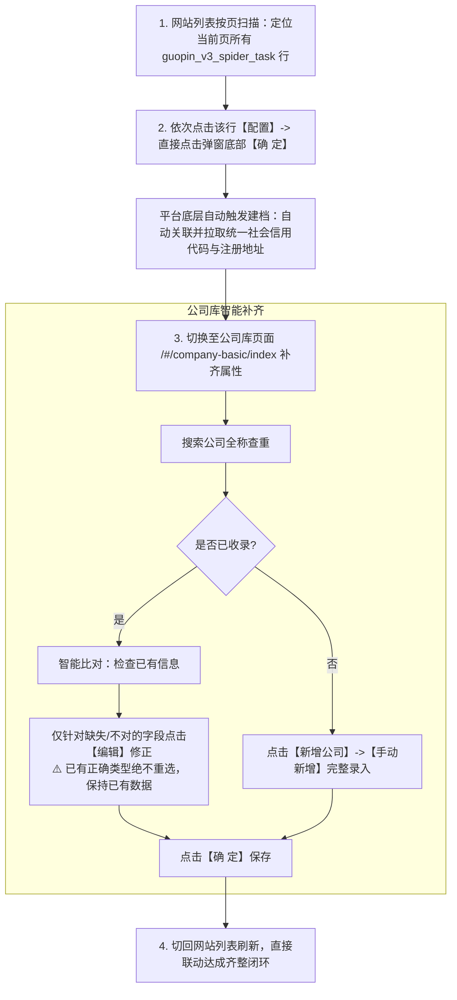
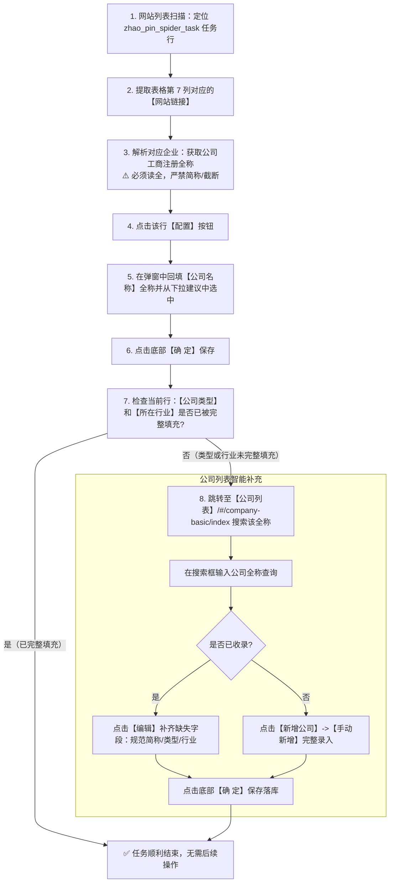

# 招聘网站 RPA 全自动配置与公司库录入系统操作手册

> [!CAUTION]
> ### 🚨 【AI 角色铁律与极简三步作业流】（任何 AI 助手必须 100% 恪守，严禁越界）
> 1. **严禁编写任何 DOM 自动化与浏览器交互临时脚本**：
>    - 严禁临时编写任何 `check_xxx.py`、`inspect_xxx.py`、`test_xxx.py`、`step_xxx.py` 去连接 CDP、查 DOM、点弹窗！
>    - 系统已全面固化原生 runner 工具链，所有页面定位、弹窗输入、Vue Model 注入均由 runner 内部封装完成。
> 2. **AI 的唯一核心职责（画像大脑）**：
>    - AI 不是“填表工”，而是“**企业画像决策大脑**”；
>    - 拿到待办任务 URL 后，**AI 的唯一工作是：反查法定工商全称、规范简称、定性企业类型（央企/国企/民企/外资）、对齐 40 项标准行业代码，并填入标准驱动 JSON**。
> 3. **人机协同标准作业三步流（极简闭环）**：
>    - **Step 1 (脚本读)**：执行对应 runner 扫描命令（如 `python zhaopin_auto_runner.py --scan-only`），秒级导出当前页待办 `xxx_companies.json`；
>    - **Step 2 (AI 查)**：AI 集中发挥搜索与研判能力，将该 JSON 中的企业画像（全称、简称、类型、行业）补齐；
>    - **Step 3 (脚本填)**：执行 `python xxx_runner.py --file xxx_companies.json`，由原生脚本在后台全自动批量回填落库。
> 4. **单步调试唯一允许**：若需单步原子操作，只允许直接调用 `rpa_engine.py auto-close` 或 `rpa_engine.py inspect`，严禁节外生枝。

---

## 目录
- [一、操作规范与交互流程（怎么操作填入）](#一操作规范与交互流程怎么操作填入)
  - [0. 核心四大铁律与四大套系执行顺序全景对比矩阵](#0-核心四大铁律与四大套系执行顺序全景对比矩阵)
  - [1. 网站列表扫描与提取任务（以页为单位）](#1-网站列表扫描与提取任务以页为单位)
  - [2. 公司库查重与智能编辑/新增流程（/#/company-basic/index）](#2-公司库查重与智能编辑新增流程company-basicindex)
  - [3. 网站列表回填公司全称流程（/#/company/index）](#3-网站列表回填公司全称流程companyindex)
  - [4. 公司库全量翻页自查与补漏规程（/#/company-basic/index）](#4-公司库全量翻页自查与补漏规程company-basicindex)
- [二、数据与画像判定标准（操作填入哪些）](#二数据与画像判定标准操作填入哪些)
  - [🌐 【第一套】国外主流 ATS 任务画像规范（境外企业 / 外商独资）](#第一套国外主流-ats-任务画像规范境外企业--外商独资)
    - [1. 适用任务标识范围 (task_name)](#1-适用任务标识范围-task_name)
    - [2. 公司类型与地点对应规则（第一套专有）](#2-公司类型与地点对应规则第一套专有)
    - [3. 规范简称中英拼装规则 (short_name)（第一套专有）](#3-规范简称中英拼装规则-short_name第一套专有)
  - [🇨🇳 【第二套】国聘网爬虫任务画像规范（国内招聘：央企 / 国企 / 事业单位 / 民企等）](#第二套国聘网爬虫任务画像规范国内招聘央企--国企--事业单位--民企等)
  - [💼 【第三套】智联招聘爬虫任务规范（`zhao_pin_spider_task`）](#第三套智联招聘爬虫任务规范zhao_pin_spider_task)
  - [🧪 【第三套·实验阶段】国内三大招聘 SaaS 任务画像与 URL 重构规律（北森 / 飞书 / Moka）](#第三套实验阶段国内三大招聘-saas-任务画像与-url-重构规律北森--飞书--moka)
    - [1. 三大平台 URL 核心特征与重构黄金法则](#1-三大平台-url-核心特征与重构黄金法则)
    - [2. 🇨🇳 北森平台 (`beisen_spider_task`) 规则与实战样本](#2--北森平台-beisen_spider_task-规则与实战样本)
    - [3. 🕊️ 飞书平台 (`feishu_spider_task`) 规则与实战样本](#3-️-飞书平台-feishu_spider_task-规则与实战样本)
    - [4. 🎯 Moka 平台 (`moka_spider_task`) 规则与实战样本](#4--moka-平台-moka_spider_task-规则与实战样本)
    - [5. 🛡️ 推测 URL 后的自动化真实页面验证机制（Validation Gate）](#5-️-推测-url-后的自动化真实页面验证机制validation-gate)
  - [🎯 【第四套·探索突破】前程无忧 / 应届生求职网任务画像与公司获取全链路 (`five_one_job_spider_task`)](#第四套探索突破前程无忧--应届生求职网任务画像与公司获取全链路-five_one_job_spider_task)
  - [📊 【通用参考标准】三大套系通用规范](#通用参考标准三大套系通用规范)
    - [1. 全量 40 项行业标准映射与 Vue 底层 ID 字典（100% 官方真实对照）](#1-全量-40-项行业标准映射与-vue-底层-id-字典100-官方真实对照)
    - [2. 标准 JSON 中间文件结构](#2-标准-json-中间文件结构)
- [三、标准执行命令与脚本使用指南](#三标准执行命令与脚本使用指南)
  - [1. 前置环境与准备工作](#1-前置环境与准备工作)
  - [2. 🚀 核心固化统一执行引擎 (`rpa_engine.py`)](#2--核心固化统一执行引擎-rpa_enginepy)
  - [3. 🌐 套系一：国外主流 ATS 闭环脚本使用指南 (`universal_company_filler.py`)](#3--套系一国外主流-ats-闭环脚本使用指南-universal_company_fillerpy)
  - [4. 🇨🇳 套系二：国聘网全自动连续翻页闭环脚本使用指南 (`guopin_auto_runner.py`)](#4--套系二国聘网全自动连续翻页闭环脚本使用指南-guopin_auto_runnerpy)
  - [5. 💼 套系三：智联招聘全自动闭环机制与流程 (`zhao_pin_spider_task`)](#5--套系三智联招聘全自动闭环机制与流程-zhao_pin_spider_task)
- [四、页面底层 DOM 与 Vue Model 交互速查手册（免探索手册）](#四页面底层-dom-与-vue-model-交互速查手册免探索手册)
  - [1. 网站列表页 (`/#/company/index`) 表格结构与核心选择器（含链接替换与岗位分类）](#1-网站列表页-companyindex-表格结构与核心选择器含链接替换与岗位分类)
  - [2. 公司列表页 (`/#/company-basic/index`) 表格结构与核心选择器](#2-公司列表页-company-basicindex-表格结构与核心选择器)
  - [3. 企业类型 `org_type_new` 官方 18 项 Value 字典与纯净注入规范](#3-企业类型-org_type_new-官方-18-项-value-字典与纯净注入规范)
  - [4. 所属行业 `industry_new` 级联选择器双派发注入规范](#4-所属行业-industry_new-级联选择器双派发注入规范)
  - [5. 弹窗遮罩层与防卡死核心函数速查](#5-弹窗遮罩层与防卡死核心函数速查)
  - [6. 防实时并发插入错位核心函数（URL 动态寻行与双向熔断机制）](#6-防实时并发插入错位核心函数url-动态寻行与双向熔断机制)
- [五、各平台岗位分类 (0/1/2) 与 URL 重构标准字典](#五各平台岗位分类-012-与-url-重构标准字典)
  - [1. 岗位分类定义（仅适用于 `moka_spider_task`）](#1-岗位分类定义仅适用于-moka_spider_task)
  - [2. 各平台 URL 标准化重构与岗位分类映射表](#2-各平台-url-标准化重构与岗位分类映射表)
  - [3. 执行规范铁律（免探索法则与过程文件用完即清铁律）](#3-执行规范铁律免探索法则)


---

## 一、操作规范与交互流程（怎么操作填入）

### 0. 核心四大铁律与四大套系执行顺序全景对比矩阵

> [!IMPORTANT]
> ### 🛡️ RPA 全自动配置核心四大铁律
> 1. **严禁行号下标定位（防动态位移）**：多爬虫并发向头部插入数据，绝对不能用 `nth(i)`！必须使用目标唯一 URL/Slug 动态寻行 + 弹窗回显 URL 双向签名熔断。
> 2. **已有真实数据绝对保护（差量补齐原则）**：已有非空地址（哪怕是详细门牌号）绝不修改或覆盖；已有正确企业类型（尤其是复合标签如“央企, 国企”）绝不单选重设破坏，仅补录空缺项。
> 3. **回填公司名称必须填入工商注册全称**：严禁填简称、别称或二级部门名（如“xx分行”、“xx项目部”），必须使用法定一级法人全称。
> 4. **【岗位分类】输入框仅限 Moka 平台**：配置弹窗中的【岗位分类】（`0`校招 / `1`实习 / `2`社招）**仅在 `moka_spider_task` 弹窗中存在**，其他所有平台（北森、飞书、智联、国聘等）均无此项，严禁填入。

#### 四大套系执行顺序全景对比矩阵

| 套系类别 | 代表平台及任务标识 | 核心业务特征 | 标准执行顺序与流向 | 为什么必须是这个顺序？（底层原理） |
| :--- | :--- | :--- | :--- | :--- |
| **套系一：<br>国外主流 ATS** | Greenhouse, Workday, SmartRecruiters, Lever 等 | 生僻境外母公司为主，系统公司库默认未建档 | **先公司库建档/核验 ➡️ 后网站列表回填绑定** | 网站配置弹窗的【公司名称】下拉框是从公司库读取的。若不先在公司库建档，在网站列表输入全称将**无法下拉联想选中并绑定底层外键**。 |
| **套系二：<br>国聘网** | `guopin_v3_spider_task` | 国内企事业单位、国央企大盘，具备平台级信用代码映射 | **网站列表直接点【配置 ➡️ 确定】 ➡️ 公司库差量补齐 ➡️ 网站刷新联动** | 网站列表直接点【确定】会触发系统底层按信用代码建档挂接。在公司库定向补齐缺失字段后，回网站列表直接 `reload()` 即可带出，**无需二次回写**。 |
| **套系三：<br>智联招聘** | `zhao_pin_spider_task` | 国内成熟企事业，后台历史建档率极高（>80%） | **先在网站列表回填工商全称 ➡️ 若完整带出直接闭环 ➡️ 若缺失才去公司库补齐** | **第一性极速省步打法**：先回填，若后台已有该企业且字段齐全，点击保存后瞬间齐整闭环；仅对未带出类型/行业的企业去公司库补全，省去 50% 以上交互。 |
| **套系四：<br>国内三大 SaaS** | `moka_spider_task`<br>`feishu_spider_task`<br>`beisen_spider_task` | 存在单岗位过期死链、URL 需重构清洗且可能遇到 URL 查重冲突 | **先在网站列表验证重构 URL 并配置 ➡️ 再去公司库建档/维护 ➡️ 补挂接校验** | 国内 SaaS 极易发生“同 URL 网站已存在”的查重拦截。若先在公司库建档，遇到网站查重冲突跳过时会导致公司库产生孤儿脏数据。先配网站可提前阻断风险。 |

#### 全景决策流程图

```mermaid
flowchart TD
    Start([识别爬虫任务 task_name]) --> TaskType{属于哪一套系?}

    %% 套系一
    TaskType -- 国外主流 ATS --> F_Step1[1. 公司库查重 / 新增境外企业建档]
    F_Step1 --> F_Step2[2. 网站列表动态寻行 -> 配置回填全称并下拉选中]
    F_Step2 --> F_End([✅ 齐整闭环])

    %% 套系二
    TaskType -- 国聘网 guopin --> G_Step1[1. 网站列表点击【配置】-> 直接点击底部【确 定】触发底层挂接]
    G_Step1 --> G_Step2[2. 公司库搜索该企业 -> 仅补齐空缺行业/简称 (已有地址绝不改)]
    G_Step2 --> G_Step3[3. 网站列表页面 reload 刷新 -> 自动带出类型与行业]
    G_Step3 --> G_End([✅ 齐整闭环])

    %% 套系三
    TaskType -- 智联招聘 zhao_pin --> Z_Step1[1. 页面/数据源精准反查法定工商全称]
    Z_Step1 --> Z_Step2[2. 先直接在网站列表配置回填该全称并保存]
    Z_Step2 --> Z_Check{当前行类型与行业已完整带出?}
    Z_Check -- 是 --> Z_End([✅ 秒级极速闭环，免去公司库交互])
    Z_Check -- 否 --> Z_Step3[3. 前往公司库搜索 -> 补齐缺失字段或手动新增]
    Z_Step3 --> Z_End

    %% 套系四
    TaskType -- 国内三大 SaaS Moka/飞书/北森 --> S_Step1[1. 重构 URL + 验活 ➡️ 网站列表配置 (含 Moka 岗位分类 0/1/2)]
    S_Step1 --> S_Conflict{是否触发网站重复冲突?}
    S_Conflict -- 是 --> S_Skip[点击确定跳过并记录告警，不操作公司库]
    S_Conflict -- 否 --> S_Step2[2. 前往公司库维护: 简称/类型/40项行业 (保护已有地址)]
    S_Step2 --> S_End([✅ 齐整闭环])
```

---

### 1. 网站列表扫描与提取任务（以页为单位）
- **操作页面**：`/#/company/index`
- **操作规则**：
  1. 以当前查看的页面（如第 10 页、第 11 页）为基本单位；
  2. 检查表格第 5 列（任务名称 `task_name`），筛选属于[国外 ATS 任务类型](#1-适用任务类型范围-task_name)的行；
  3. 提取对应的【网站链接】（表格第 7 列 URL），结合公司挖掘结果，生成或覆盖本页的 `foreign_companies.json`。

---

### 2. 公司库查重与智能编辑/新增流程（/#/company-basic/index）

#### 步骤 1：查重搜索
1. 定位顶部搜索框：`input[placeholder*='输入关键词搜索']`；
2. 清空并填入目标公司的**【工商注册全称】**；
3. 点击【搜索】按钮，等待表格刷新（约 1 秒）。

#### 步骤 2：判断是“跳过”、“编辑”还是“新增”
- **情况 A：搜索到该公司 且 信息已全部正确**
  - 读取搜索结果行的各项文本：`[序号, 公司名称, 简称, 类型, 行业, 标签, 地点]`；
  - 若 `简称`、`类型`、`行业`、`地点` 均与目标画像完全一致：
  - **直接跳过，秒切下一家！严禁再次点击编辑或重新选择类型，避免破坏已有正确数据。**

- **情况 B：搜索到该公司 但 信息有误或缺失（如类型错写为“律所”或行业为空）**
  - 找到匹配行，点击操作列的**【编辑】**按钮；
  - 等待【编辑信息】弹窗弹出；
  - **差量修正**：仅针对不一致的字段修改：
    - 若简称不符：填入规范简称；
    - 若地点不符：填入标准地点；
    - 若类型不符：执行[类型 UI 选择步骤](#类型-ui-真实模拟点击步骤)；
    - 若行业不符：执行[行业 Vue 注入步骤](#行业-vue-底层数据注入步骤)；
  - 点击弹窗底部【确 定】按钮，等待遮罩层 `.v-modal` 自然淡出。

- **情况 C：未搜索到该公司（新企业入库）**
  - 点击表格上方的**【新增公司】**按钮；
  - 在弹出窗口中点击**【手动新增】**；
  - 在【编辑信息】弹窗中依次填写：
    1. **名称**：`input[placeholder*='请输入名称']` 填入**公司工商全称**；
    2. **简称**：`input[placeholder*='请输入简称']` 填入**中英紧贴规范简称**；
    3. **地点**：`input[placeholder*='请输入地点']` 填入**标准地点**；
    4. **类型**：执行[类型 UI 选择步骤](#类型-ui-真实模拟点击步骤)；
    5. **行业**：执行[行业 Vue 注入步骤](#行业-vue-底层数据注入步骤)；
  - 点击底部【确 定】按钮，等待保存完成且遮罩层销毁。

---

#### 核心操作技巧与规范指引

为杜绝组件状态残留与事件丢失，所有表单赋值一律调用[第四章：页面底层 DOM 与 Vue Model 交互速查手册](#四页面底层-dom-与-vue-model-交互速查手册免探索手册)中封装的工业级函数：
1. **企业类型赋值**：统一使用 [`set_clean_org_type`](#3-企业类型-org_type_new-官方-18-项-value-字典与纯净注入规范)，严禁直接用 UI 点选多选下拉菜单，杜绝历史 tag 残留累加；
2. **所属行业赋值**：统一使用 [`inject_industry_safely`](#4-所属行业-industry_new-级联选择器双派发注入规范)，必须同步派发 Cascader 组件事件；
3. **弹窗与遮罩层等待**：点击确定后统一调用 [`wait_modal_gone`](#5-弹窗遮罩层与防卡死核心函数速查)，必须等待 `.v-modal` 遮罩层完全淡出销毁。

---

### 3. 网站列表回填公司全称流程（/#/company/index）
- **操作页面**：`/#/company/index`
- **核心原则**：**回填公司名称时必须填入【公司工商全称】，严禁填入简称！**

> ⚠️ **高频并发插入错位死律（为什么严禁按行号下标 `nth(i)` 定位）**：
> 在多爬虫并发运行环境下，第一页顶部会实时不断插入新的抓取任务，导致表格已有行动态向下位移！
> - **致命隐患**：如果脚本预先快照表格行数并按 `0, 1, 2...` 依次点击，在处理过程中一旦顶部插入了新行，原先的目标行就会被下移，导致脚本点击到错位的另一家公司，把 A 公司全称错填给 B 公司！
> - **根治规范**：**彻底废弃行号下标！必须统一采用【目标唯一 URL 动态实时寻行】+【弹窗内 URL 签名双向熔断校验】双保险机制！**

#### 标准操作步骤：
1. **URL 动态实时寻行**：每次操作前，必须以目标唯一的 `target_url` 在当前 DOM 中动态筛选匹配行，绝不使用固定的行下标：
   ```python
   matched_row = page_site.locator(".el-table__body-wrapper tbody tr").filter(
       has=page_site.locator(f"td:has-text('{target_url}')")
   ).first
   ```
2. **唤出配置**：点击该匹配行的**【配置】**按钮；
3. **弹窗 URL 双向校验锁（Fail-Safe 终极熔断）**：
   在输入任何内容前，先读取弹窗内预填的 `input[placeholder='请输入网站链接']`：
   - 若 `dialog_url == target_url`：校验通过，继续回填；
   - 若 `dialog_url != target_url`：说明遭遇极端并发插入导致点击发生错位，**立即点击弹窗右上角关闭按钮放弃本次操作，安全退出，绝不执行保存**！
4. **定位输入框并回填全称**：在弹窗中填入【公司工商全称】：
   ```python
   comp_input = dialog.locator("input[placeholder='请输入公司名称']").first
   comp_input.fill("")
   comp_input.fill(comp_name) # 必须填入工商全称！
   page.wait_for_timeout(800)
   ```
5. **下拉选中**：在弹出的下拉联想建议列表（`.el-select-dropdown__item` 或 `.el-autocomplete-suggestion li`）中，点击与公司全称匹配的选项；若下拉未触发，按 `Enter` 键确认；
6. **保存生效**：点击弹窗底部的**【确 定】**按钮；
7. **成功校验**：监听并捕获右上角弹出的权威绿标通知：`更新成功！`。

---

### 4. 公司库全量翻页自查与补漏规程（/#/company-basic/index）

#### (1) 背景与应用场景
当用户要求“在公司列表翻查第 1~N 页，把缺少信息的公司补充完整”时，属于**公司库大盘全局巡检作业**。

#### (2) 搜索状态与分页模式互斥机制（防局部搜索假象）
> ⚠️ **核心死律（为什么不能直接点翻页器）**：
> Element UI 的分页器与顶部搜索框是严格绑定的：
> - 若顶部搜索框包含关键词（如上一次搜索遗留的“三亚城市投资”），分页器处于**搜索结果子集模式**（如只有 1 条记录，无法翻页）；
> - **全局巡检标准前置动作**：
>   1. **清空搜索框**：`search_input.fill("")`；
>   2. **触发全局重置**：必须点击【搜索】按钮（`button:has-text('搜索')`）；
>   3. **等待大盘刷新**：等待表格重新加载出大盘数据（总数通常为 14,000+ 条）；
>   4. **指定页码跳转**：通过底部跳转输入框（`.el-pagination__jump input`）填入目标页码并回车，或点击页码按钮精准翻页。

#### (3) 公司库字段差量核验四大标准
| 检查字段 | 状态判定 | 处理动作与规范 | 核心红线约束 |
| :--- | :--- | :--- | :--- |
| **公司名称** | 查重与有效性 | 工商注册法定全称，作为唯一身份索引 | 遇到更名前后双记录时（如“有限责任公司”变更为“股份有限公司”），以最新合法有效全称为准补充。 |
| **规范简称** | 为空时补充 | 填入公认中文规范简称（国内企业如“健帆生物”、“中色东方”；外企如“西门子医疗SiemensHealthineers”） | 严禁填入过于口语化或带无关前缀的简称。 |
| **企业类型** | 为空时补充 | 官方 18 项标准类型（民企、国企、央企、外商独资、上市、事业单位等） | 🚨 **复合类型保护铁律**：若已有复合标签（如“`央企, 国企`”、“`中外合资, 上市`”），**绝对禁止单选覆盖破坏**！已有类型正确的严禁重置。 |
| **所属行业** | 为空时补充 | 官方 40 项一级行业（真实 Vue ID 必须通过双派发注入） | 严禁使用过时字典 ID（如将智能家居误填为 34，必须填真实一级分类 35）。 |
| **地址 / 地点** | 区分空与非空 | ① **已有非空地址**：**100% 绝对保护原样保留**，严禁擅自覆盖或删改；<br>② **地址原本为空**：国内企业优先补充其**总部所在城市或地级市**（如“深圳”、“上海”、“北京”、“襄阳”）。 | 🚨 **严禁编造详细门牌号**：若原本为空，只填地级市即可，严禁凭主观臆想随意拼凑或编造街道门牌号！ |

---

## 二、数据与画像判定标准（操作填入哪些）

### 🌐 【第一套】国外主流 ATS 任务画像规范（境外企业 / 外商独资）

#### 1. 适用任务标识范围 (task_name)
针对纯海外招聘或国外知名外企，系统识别以下爬虫任务标识：

| 任务标识 (`task_name`) | 对应招聘平台 (ATS) | 常见 URL 域名特征 |
| :--- | :--- | :--- |
| `green_house_spider_task` | Greenhouse | `boards.greenhouse.io`, `job-boards.greenhouse.io` |
| `workday_spider_task` | Workday | `*.myworkdayjobs.com`, `wd1.myworkdayjobs.com` 等 |
| `smart_spider_task` | SmartRecruiters | `jobs.smartrecruiters.com`, `smartrecruiters.com` |
| `lever_spider_task` | Lever | `jobs.lever.co`, `lever.co` |
| `oracle_hcm_spider_task` | Oracle HCM Cloud | `*.oraclecloud.com/hcmUI/CandidateExperience/...` |
| `taleo_spider_task` | Oracle Taleo | `*.taleo.net` |
| `ashby_spider_task` | Ashby | `jobs.ashbyhq.com` |
| `icims_spider_task` | iCIMS | `*.icims.com` |
| `eight_fold_spider_task` | Eightfold | `*.eightfold.ai` |

#### 2. 公司类型与地点对应规则（第一套专有）

| 企业属性 | 判定依据 | 【类型】填入值 | 【地点】填入值规范 | 典型示例 |
| :--- | :--- | :--- | :--- | :--- |
| **纯境外外企** | 公司为国外企业，在中国大陆**无独立法人机构**，属于海外直接招聘 | **`境外企业`** | 一律填写其海外总部**国家名称**（如：`美国`、`英国`、`德国`、`瑞士`） | `West Virginia University Health System` ➡️ 地点：`美国` |
| **外商在中国法人** | 外国企业但在中国大陆开设有分公司/全资子公司/实体机构 | **`外商独资`** | 一律填写其在中国大陆的总机构**城市名称**（如：`上海`、`北京`、`深圳`），**严禁填国外** | `荷美尔（中国）投资有限公司` ➡️ 地点：`上海` |

> ⚠️ **第一套死律警告**：
> - 地点在国外的，类型**必须且只能**选择 **`境外企业`**！
> - 绝对不能选成“民企”、“律所”或其他无关类型！

#### 3. 规范简称中英拼装规则 (short_name)（第一套专有）
* **基本格式**：**中文名 + 英文原名紧贴，中间严禁空格、斜杠、横杠或括号**。
* **有行业公认中文名**：中文名 + 英文原名。
  - `Hormel` ➡️ `荷美尔Hormel`
  - `Emerson` ➡️ `艾默生Emerson`
  - `Allegion` ➡️ `安朗杰Allegion`
  - `BNY Mellon` ➡️ `纽约梅隆银行BNY`
  - `WorldQuant` ➡️ `世坤投资WorldQuant`
* **无公认中文名（国外大学/机构/纯外企）**：音译或机构意译 + 英文原名紧贴。
  - `West Virginia University Health System` ➡️ `西弗吉尼亚大学医疗WVUMedicine`
  - `Syfan Logistics, Inc.` ➡️ `赛凡物流Syfan`
  - `DIRECTV Entertainment Holdings LLC` ➡️ `直播电视DIRECTV`
  - `Cerity Partners LLC` ➡️ `塞瑞蒂合伙人CerityPartners`
  - `International Justice Mission` ➡️ `国际正义使命团IJM`

---

### 🇨🇳 【第二套】国聘网爬虫任务画像规范（国内招聘：央企 / 国企 / 事业单位 / 民企等）

#### 1. 核心业务理念与闭环流程
针对国内企事业单位、国央企及民营企业的国聘网任务 (`guopin_v3_spider_task`)，采用**“以页为单位：先触发平台建档 ➡️ 公司库核对/精准补齐 ➡️ 网站列表刷新联动”**的闭环工作流：



#### 2. 适用任务标识范围 (task_name)
| 任务标识 (`task_name`) | 对应招聘平台 | 常见 URL 域名特征 | 适用企业类型 |
| :--- | :--- | :--- | :--- |
| `guopin_v3_spider_task` | 国聘 (iguopin.com) | `https://www.iguopin.com/company?id=...` | 央企 / 国企 / 事业单位 / 民企 / 中外合资 / 外商独资等 |

#### 3. 详细操作规范三步法

##### 步骤一：触发平台自动建档（以页为单位）
1. 在网站列表页（`/#/company/index`），扫描当前页全部 `guopin_v3_spider_task` 行；
2. 依次点击该行的**【配置】**按钮；
3. 在弹出的【网站配置】对话框中，**无需修改任何内容，直接点击底部【确 定】按钮**；
4. **底层原理（实测验证）**：国聘平台在点击配置并确定后，后台会自动触发初次建档，并自动带出该企业的**统一社会信用代码**与**详细注册地址**，使网站任务行与公司库记录建立天然底层外键关联绑定。
   - **关于类型与行业**：根据爬虫源数据完整度不同，**少数企业确实会自动生成【公司类型】或【所在行业】**；但**大部分时候这两个属性为空**。
   - **操作指导原则**：后续在公司库必须贯彻**“有则原样保护、缺则定向补齐”**的差量原则，绝不盲目重置已有属性，仅对空缺属性进行精准补录。

##### 步骤二：公司库搜索判断与定向差量补齐
进入公司基本信息库（`/#/company-basic/index`）：
1. 搜索公司全称；
2. **已收录的情况**：
   - 详细检查已有的各个字段；
   - **绝不能已有类型又重新选一次**（避免受控组件误重置导致已有类型丢失！）；
   - 仅当字段缺失（如缺少行业 ID 或缺少规范简称/类型）时，才点击【编辑】补齐对应输入框或底层注入行业 ID；
3. **未收录的情况**：
   - 点击【新增公司】->【手动新增】；
   - 补齐工商全称、规范简称、地点、真实点击类型、Vue 注入行业 ID，保存入库。

##### 步骤三：切回网站列表刷新联动闭环
由于步骤一中已经建立了底层任务绑定，公司库补齐保存后，只需在网站列表页执行 `reload()` 刷新，当前页对应的国聘任务行即会瞬间自动带出【公司类型】和【所在行业】，达成 `[✅ 齐整闭环]`。

> ⚠️ **核心避坑与精简准则（严禁多余冗余操作）**：
> - **智联招聘任务（`zhao_pin_spider_task`）**：**极简第一性流程**——获取工商全称后，**直接先在网站列表点击【配置】回填保存**！若类型与行业已完整带出，直接秒级闭环，免去公司库一切交互；若未带出，再精准跳转公司列表补充/建档即可。
> - **国聘网（`guopin_v3_spider_task`）**：在第一步点击【配置 ➡️ 确定】时，网站任务行与公司库记录就已经天然底层绑定！在公司库完成补充后直接刷新即可联动，**严禁在网站列表重复二次回写点击**。
> - **国外 ATS 任务（套系一）**：通常为生僻境外母公司，采用先在公司库建档/核对，再回网站列表回填绑定的流程。
> - **死律要求（特殊情况：公司库补充后网站列表仍未联动）**：
>   如果碰到在【公司基本信息库】中已经完成补充/新增，但回到【网站列表】刷新后该行的【公司类型】或【所在行业】依然为空的情况：
>   **绝对不要再次去点击该行的【配置】尝试输入全称或点确定！**
>   此类情况涉及系统底层的复杂映射机制，**保持原样，直接在最后的执行总结中将其单列汇报给用户即可**，切勿强行点击或做多余动作！
> - **🚨 【地址/地点保护绝对铁律（严禁篡改覆盖真实注册地址）】**：
>   1. **官方地址权威性**：平台通过国聘/工商大数据自动绑定的企业地址通常包含法定详细门牌号（如 `海南省三亚市...凤凰岛1号楼`、`北京市朝阳区建国路99号`），是系统珍贵真实数据；
>   2. **已有地址绝对不改**：比对时**只要现有地址（`cur_location`）非空，一律直接保留，绝不修改、缩写或覆盖**！
>   3. **纯粹按需补齐**：仅当现有地址字段为空（`""`）且外部显式指定了地点时，才允许填入；
>   4. **严禁默认硬编码**：CLI 参数与脚本变量一律默认为空字符串 `""`，严禁使用 `"北京"` 等兜底默认值导致误篡改。

---

### 💼 【第三套】智联招聘爬虫任务规范（`zhao_pin_spider_task`）

#### 1. 核心业务流程与闭环逻辑
针对智联招聘爬虫任务 (`zhao_pin_spider_task`)，采用**“获取链接 ➡️ 读全公司名称 ➡️ 网站配置回填 ➡️ 行完整度检查 ➡️ 按需公司库补齐”**的高效闭环工作流：



#### 2. 适用任务标识范围
| 任务标识 (`task_name`) | 对应招聘平台 | 常见 URL 域名特征 | 适用企业类型 |
| :--- | :--- | :--- | :--- |
| `zhao_pin_spider_task` | 智联招聘 (zhaopin.com) | `https://xiaoyuan.zhaopin.com/company/...` | 央企 / 国企 / 上市 / 民企 / 中外合资等 |

#### 3. 详细操作规范四步法

##### 步骤一：获取网站链接并精准解析公司全称
1. 在网站列表页（`/#/company/index`），定位任务标识为 `zhao_pin_spider_task` 的行；
2. 提取表格中的【网站链接】（通常为校园招聘或社招企业主页 URL）；
3. 读取/解析该链接所对应的企业：
   - **⚠️ 核心死律**：这里的**公司名称一定要读全**！必须使用标准的工商注册全称（如：`中国航发控制系统研究所`、`中国邮政储蓄银行股份有限公司`、`中邮金融资产投资有限公司`），**严禁使用简称、别称或被截断的半截名称**。

##### 步骤二：网站配置回填公司全称并确定
1. 点击该行操作列的**【配置】**按钮，唤出【网站配置】弹窗；
2. 定位公司名称输入框：`input[placeholder='请输入公司名称']`；
3. 将上一步获取的**完整公司全称**填入输入框；
4. 在弹出的下拉联想建议列表（`.el-select-dropdown__item` 或 `.el-autocomplete-suggestion li`）中，精准点击与公司全称一致的选项；
5. 点击弹窗底部**【确 定】**按钮，等待更新成功并关闭弹窗。

##### 步骤三：检查当前行【公司类型】与【所在行业】完整度
保存后刷新或重新读取当前表格行数据，检查该行的：
- **【公司类型】**（第 3 列）
- **【所在行业】**（第 4 列）
1. **若已被完整填充**（类型与行业均非空）：
   - 证明系统底层已成功联动并带出完整档案，**当前任务直接结束，无需多余操作**！
2. **若未完整填充**（类型或行业任一字段为空）：
   - 说明该企业在后台底层公司库中的档案不完整或尚未标准建档，进入**步骤四**。

##### 步骤四：跳转公司列表补充完整
1. 切换至【公司列表】页面（`/#/company-basic/index`）；
2. 在顶部搜索框输入该**完整公司名称**进行查重：
   - **若已存在但信息缺失**：点击该行【编辑】按钮，针对性补齐规范简称、核对确认企业类型（民企/国企/上市等，注意保护已有正确类型不乱改）、底层 Vue 注入 100% 真实的行业 ID 并触发 Cascader 事件，点击【确 定】保存；
   - **若未收录**：点击【新增公司】->【手动新增】，依次录入完整公司全称、规范简称、标准地点、点选企业类型、注入行业 ID，保存入库。

---

#### 4. 🚨 智联招聘实战核心避坑与提速秘籍（血泪经验总结）

##### 避坑 1：严防“子机构 / 二级部门”名称李代桃僵（核心陷阱）
- **陷阱表现**：智联招聘校园主页（`https://xiaoyuan.zhaopin.com/company/KA...`）顶部的页面 DOM（如 `.company-name`、`h1` 或职位发布主体）常常展示的是下级分公司或部门，例如：**“北京市分公司”**、**“总行本部”**、**“中邮投资”**。若直接读取该 DOM 填入，会导致公司名称严重失真或在后台查无此人！
- **秒级破解秘籍（直接读取底层 Vue Model 数据，无需解析 DOM）**：
  智联招聘页面在 `window.__INITIAL_DATA__` 中完整挂载了企业档案：
  ```javascript
  // 一秒获取精准法定工商全称（无需猜测 DOM）
  const companyBase = window.__INITIAL_DATA__?.company?.companyState?.companyBase;
  const fullName = companyBase?.campusCompanyName || companyBase?.campusOrgName;
  ```
  - `campusCompanyName` 永远是真正的一级法人全称（如：`中国邮政集团有限公司`、`中国邮政储蓄银行股份有限公司`、`中国航发控制系统研究所`）；
  - **独立一级子公司判断**：若 `campusCompanyName` 为简称（如“中邮投资”），需在页面简介首句提取其法定工商全称（如简介明示：“2026年3月，中邮金融资产投资有限公司（以下简称中邮投资）挂牌成立” ➡️ 取工商全称 **`中邮金融资产投资有限公司`**）。

##### 避坑 2：先回填网站列表 ➡️ 缺字段才去公司库（第一性原理极速省步打法）
- **传统多余做法**：无脑先切到【公司列表】查重、补齐，再切回网站列表回填。这种做法步骤繁琐，很多原本库里就有的企业白白耗费了查询和等待时间。
- **第一性原理最佳实践（用户亲授避坑秘籍）**：
  1. 获取工商注册全称后，**直接先在【网站列表】点击【配置】填入并保存**！
  2. 智联招聘所涉国内企业在后台已有档案的比例极高：一旦在网站列表填入，若底层已有该企业且字段齐全，**系统会自动联动带出【类型】与【行业】，瞬间齐整闭环，完全无需访问公司列表**（节省 50% 以上交互步骤）！
  3. **按需补齐**：仅当在网站列表保存后，发现【公司类型】或【所在行业】仍未完整带出（说明公司库未建档或字段残缺），才切去【公司列表】看一眼是否有需要补充的，针对性查重/编辑补齐/手动新增。
  4. 这种“先试回填、齐整即过、残缺才补”的轻量化顺序，极大减少了不必要的页面往返与加载耗时。

##### 避坑 3：科研院所与事业单位的工商全称与信用代码
- **实战示例**：`中国航发控制系统研究所`（无锡 614 所）。
- 很多科研院所为中编办/事业单位法人，而非工商有限责任公司。其登记全称即为“中国航发控制系统研究所”（统一社会信用代码为 `81320200MC0770148D`），类型属于 **`事业单位`**（字典代码为 `'10'`），行业归属于 **`军工/航天/航空`**（真实 ID 为 `['16']`）。规范简称为 `中国航发动控所`。

##### 避坑 4：避免在 Windows PowerShell 下使用多重引号命令行探测
- 在 Windows PowerShell 下，尽量避免执行 `python -c "eval('...\"...\'...')"` 这种嵌套多重单双引号的复杂代码，极易因转义差异引发 `SyntaxError: unterminated triple-quoted string literal`；
- 所有页面逻辑直接使用已固化的 Python 脚本或标准 runner 执行。

---

### 🧪 【第三套·实验阶段】国内三大招聘 SaaS 任务画像与 URL 重构规律（北森 / 飞书 / Moka）

> ⚠️ **阶段状态声明**：
> - **非正式量产套系**：本套系当前处于**探索与实验验证阶段**；
> - **攻克目标**：针对国内企业自建招聘系统中使用最广泛的三大 SaaS 平台（北森、飞书招聘、Moka），解决爬虫直接采集时极易引入的**内推鉴权死链、单岗位落地页时效过期失效、以及如何反查法定企业工商全称**等痛点。

---

#### 1. 三大平台 URL 核心特征与重构黄金法则

| 平台任务 | 典型域名特征 | 常见错误 / 脏数据陷阱 | 正确标准列表页结构 | 自动化重构黄金规则 |
| :--- | :--- | :--- | :--- | :--- |
| **北森**<br>`beisen_spider_task` | `*.zhiye.com` | ① 单岗位详情带 UUID：`/campus/detail?jobAdId=...`<br>② 单岗位路径：`/job/detail/{id}` | ① 校招：`https://{slug}.zhiye.com/campus/jobs`<br>② 社招：`https://{slug}.zhiye.com/social/jobs` | 凡包含 `/detail`，直接截断剥离单岗位参数，规范替换为 `/{channel}/jobs` |
| **飞书**<br>`feishu_spider_task` | ① `*.jobs.feishu.cn`<br>② 独立企业域名（如 `hr-jobs.*.com`） | ① 内推单岗位 `/referral/.../detail`（无 token 访问强制跳转 `/notoken` 报错页面不存在）<br>② 单岗位失效死链 `/{channel}/position/{id}/detail` | ① 渠道标准列表：`https://{slug}.jobs.feishu.cn/{channel}/position/list`<br>② 门户总入口：`https://{slug}.jobs.feishu.cn/index`<br>③ 独立域名：保留频道（如 `/exp/`） | ① 若含单岗位路径 `/position/{id}/detail`，保留前面的域名与频道，直接重写为 **`/position/list`**；<br>② 无特定频道时，通用入口改写为 `/index`（页面标题或 meta 自动输出企业全称） |
| **Moka**<br>`moka_spider_task` | `app.mokahr.com`<br>`app-tc.mokahr.com` | ① 单岗位 Hash 缺少 `s`：`#/job` 或 `#/job?jobId=...`<br>② 单岗位投递动作：`#/job/{id}/apply`<br>③ 误采个人简历编辑页：`/resume/edit` | `https://app.mokahr.com/{type}/{slug}/{site_id}?locale=zh-CN#/jobs`<br>*(例如 `campus-recruitment` / `social-recruitment`)* | ① **严禁丢弃 Query**：必须原样保留 `?locale=zh-CN` 等环境参数；<br>② 末尾 Hash 路由必须统一将 `#/job/...` 规范重写为 **`#/jobs`**（带 `s`） |

---

#### 2. 🇨🇳 北森平台 (`beisen_spider_task`) 规则与实战样本

##### (1) 机制与重构要点
- **标准列表路由**：校招统一为 `/campus/jobs`，社招统一为 `/social/jobs`；
- **单岗位避坑案例**：如样本 14（卓望科技），原始链接采到了 `http://aspire.zhiye.com/campus/detail?jobAdId=e731...`，岗位一旦下架页面即失效，导致网站名称全空。剥离重构为 `https://aspire.zhiye.com/campus/jobs` 后即可永续全量抓取。

##### (2) 6 组典型实战样本对照表（精炼典型代表）
| 序号 | 网站名称（公司工商全称） | 收集到的当前链接 | 正确标准链接 | 链接状态与特征说明 |
| :---: | :--- | :--- | :--- | :--- |
| 1 | 深圳市大成精密设备股份有限公司 | `https://dcprecision1.zhiye.com/campus/jobs` | `https://dcprecision1.zhiye.com/campus/jobs` | ✅ 标准校招列表页 |
| 2 | 宁波中大力德智能传动股份有限公司 | `https://zdldoa1.zhiye.com/social/jobs` | `https://zdldoa1.zhiye.com/social/jobs` | ✅ 标准社招列表页 |
| 3 | 珠海雷特科技股份有限公司 | `https://morningfast.zhiye.com/campus` | `https://morningfast.zhiye.com/campus/jobs` | ✅ 校招聚合主页（自动重定向到 jobs） |
| 4 | 山推工程机械股份有限公司 | `https://shantui.zhiye.com./campus/jobs` | `https://shantui.zhiye.com/campus/jobs` | ⚠️ 域名多了一个点（脏数据清洗为标准域） |
| 5 | 卓望信息技术（北京）有限公司 | `http://aspire.zhiye.com/campus/detail?jobAdId=e731...` | `https://aspire.zhiye.com/campus/jobs` | ❌ **单岗位详情页**（带 jobAdId 易过期失效，剥离重构为永续大厅） |
| 6 | 上海东方算芯科技有限公司 | `https://ecosda.zhiye.com/campus/detail?jobAdId=7e22...` | `https://ecosda.zhiye.com/campus/jobs` | ❌ **单岗位详情死链**，重构为 `/campus/jobs`；页面页脚标示“东方算芯”，工商核验为法定全称 |

---

#### 3. 🕊️ 飞书平台 (`feishu_spider_task`) 规则与实战样本

##### (1) 机制与重构要点
- **`position/list` 列表路由核心法则**：当原始链接形如 `/{channel}/position/{id}/detail`（如 `/xz/position/.../detail` 或 `/campus/position/...`）时，**切忌盲目改写为 `/index`（此类企业子频道通常无 `/index` 会报 404）**！正确做法是保留频道路径（如 `/xz/`），将末尾单岗位替换为官方标准列表 **`/position/list`**（如 `https://{slug}.jobs.feishu.cn/xz/position/list`）；
- **飞书专属全称反查神技**：
  1. **标题规则**：多数标准门户入口渲染完成后，`document.title` 中 100% 规范格式为 `加入[公司工商全称]`（如：`加入南京英锐创电子科技有限公司`）；
  2. **Meta 描述规则**：若标题仅为简称或项目名，页面 `<meta name="description">` 通常明示 `“到[公司工商全称]，开启你的新工作”`，两者配合可实现工商全称 100% 零误差反查；
- **独立企业域名避坑**：针对自建域名（如 `hr-jobs.sensetime.com`、`jobs.xinchenai.com`），必须保留特定频道入口（如 `/exp/` 或 `/campus/`）。

##### (2) 6 组典型实战样本对照表（精炼典型代表）
| 序号 | 网站名称（公司工商全称） | 收集到的当前链接 | 正确标准链接 | 链接状态与特征说明 |
| :---: | :--- | :--- | :--- | :--- |
| 1 | 琻捷电子科技（江苏）股份有限公司 | `https://sen-asic.jobs.feishu.cn/index` | `https://sen-asic.jobs.feishu.cn/index` | ✅ 英文简称域名门户入口（由内推 referral 死链重构） |
| 2 | 厦门延趣网络科技有限公司 | `https://yanqugame.jobs.feishu.cn/xz/position/7645.../detail` | `https://yanqugame.jobs.feishu.cn/xz/position/list` | ❌ **单岗位校招死链**。盲猜 `/index` 会 404；保留 `/xz/` 频道并改写为 `/position/list`；Meta 标签反查全称 |
| 3 | 北京市商汤科技开发有限公司 | `https://hr-jobs.sensetime.com/exp/` | `https://hr-jobs.sensetime.com/exp/` | ✅ 独立企业自建域名（必须保留社招 `/exp/` 频道主入口） |
| 4 | 茶姬企业管理（集团）有限公司 | `https://jobs.chagee.com/index/position/list` | `https://jobs.chagee.com/index/position/list` | ✅ 霸王茶姬独立域名标准列表路由 |
| 5 | 深圳康诺思腾科技有限公司 | `https://cornerstone.jobs.feishu.cn/174207/position/list` | `https://cornerstone.jobs.feishu.cn/174207/position/list` | ✅ 医疗机器人独角兽标准列表（企业 slug + 6位租户ID） |
| 6 | 国民技术股份有限公司 | `https://nsingtech.jobs.feishu.cn/campus/position/list` | `https://nsingtech.jobs.feishu.cn/campus/position/list` | ✅ 芯片上市企业校招列表直接路由 |

---

#### 4. 🎯 Moka 平台 (`moka_spider_task`) 规则与实战样本

##### (1) 机制与重构要点
- **`#/jobs` 黄金 Hash 律**：Moka 属于纯 Hash 路由前端 SPA 应用。全量职位的唯一官方标识必须是以 `#/jobs` 结尾（带 `s`）；
- **严格保留 Query 参数**：URL 中若携带 `?locale=zh-CN` 等环境/语言参数，**必须原样保留**在 `#` 之前，丢弃可能导致前端页面跳转异常或报错；
- **单岗位申请死链剥离**：若末尾是 `#/job/{id}/apply`、`#/job?jobId=...` 或 `#/job/12345`，直接去除多余的单岗位 path，并将 Hash 整体统一规范重构为 **`#/jobs`**；
- **清理个人简历编辑链接**：如样本 7（`https://hr.xd.cn/117745/resume/edit`），因误采了简历编辑页导致未登录空白，必须修正为标准列表路由 `https://hr.xd.cn/117745/position/list`；
- **🚨【核心配置规则】网站配置弹窗【岗位分类】填写规范**：
  在网站列表点击【配置】唤出弹窗时，除了回填公司名称全称外，**必须同步填写【岗位分类】输入框**（`input[placeholder*='0 校招']`）：
  - **`0` ➡️ 校招**（URL 包含 `campus-recruitment` 或页面主招应届生/实习）；
  - **`1` ➡️ 实习**（专招实习生通道）；
  - **`2` ➡️ 社招**（URL 包含 `social-recruitment` 或页面主招有经验社招人员）。
  填写对应的数字代码（如 `'0'` 或 `'2'`），确保爬虫入库与分类标签底层精准对齐！

##### (2) 6 组典型实战样本对照表（精炼典型代表）
| 序号 | 网站名称（公司工商全称） | 收集到的当前链接 | 正确标准链接 | 链接状态与特征说明 |
| :---: | :--- | :--- | :--- | :--- |
| 1 | 宁波兴业盛泰集团有限公司 | `https://app.mokahr.com/campus-recruitment/xingyealloy/170609?locale=zh-CN#/jobs` | `https://app.mokahr.com/campus-recruitment/xingyealloy/170609#/jobs` | ✅ 标准校招列表页 |
| 2 | 东风汽车集团股份有限公司 | `https://app.mokahr.com/social-recruitment/dfmc/166505#/jobs` | `https://app.mokahr.com/social-recruitment/dfmc/166505#/jobs` | ✅ 央企社招全量列表（岗位分类填 `2`） |
| 3 | 携程集团有限公司 | `https://hire-r1.mokahr.com/apply/tripoverseas/100000877#/job` | `https://hire-r1.mokahr.com/apply/tripoverseas/100000877#/jobs` | ⚠️ **单岗位 Hash 错误**（`#/job` 缺少 `s` 导致岗位为0，修复为 `#/jobs`） |
| 4 | 江苏睿恩新能源科技有限公司 | `https://app.mokahr.com/social-recruitment/ruien/140573?locale=zh-CN#/job/4b33.../apply` | `https://app.mokahr.com/social-recruitment/ruien/140573?locale=zh-CN#/jobs` | ❌ **社招单岗位投递死链**（`#/job/.../apply`），保留 `locale` 并规范重写为 `#/jobs` |
| 5 | 心动网络股份有限公司 | `https://hr.xd.cn/117745/resume/edit` | `https://hr.xd.cn/117745/position/list` | ❌ **简历编辑脏链接**（导致数据全空），修正为标准列表路由 |
| 6 | 杉杉商业集团有限公司 | `https://app-tc.mokahr.com/campus-recruitment/vipshophr/16060#/jobs` | `https://app-tc.mokahr.com/campus-recruitment/vipshophr/16060#/jobs` | ✅ 唯品会系/杉杉商业标准列表（岗位分类填 `0`） |

---

#### 5. 🛡️ 推测 URL 后的自动化真实页面验证机制（Validation Gate）

> ⚠️ **为什么推测 URL 之后必须进行实际页面验证？**
> - **绝不盲目回填**：规律推导（如飞书改 `/index`、北森改 `/campus/jobs`、Moka 改 `#/jobs`）属于启发式规则，仍有企业存在自建路由、独立域名或招聘项目下线的特殊情况；
> - **防止把“半残单岗位”升级为“彻底 404 死链”**：若未经验证直接将盲猜的 URL 回填保存，遇到特殊情况（如商汤自建域名强行改 `/index` 会 404），会导致爬虫原先还能抓取单岗位的链路彻底报废；
> - **双重业务收益（验活 + 验真反查）**：
>   1. **验活（Liveness）**：后台无头模式预访问，核实 HTTP 状态码是否为 200/302，核验 Final URL 是否被系统重定向到 `/notoken` 或“页面不存在”；
>   2. **验真（Business Verification）**：页面加载后提取 `document.title`，利用飞书/北森等页面标题（如 `加入[公司工商全称]`）交叉比对企业合法性，实现工商全称零成本自动化反查；
> - **终极安全熔断**：**只有通过真实页面验证（Status=200 且 页面存在有效内容）的 URL，才允许执行写入操作！验证失败的 URL 必须保留原样并生成告警单列汇报！**

##### 自动化验证标准函数模板（即插即用）
```python
def validate_reconstructed_url(page_headless, candidate_url, original_url=None):
    """
    推测/重构 URL 自动化真实页面验证关卡 (Validation Gate)
    返回值: {
        'ok': bool,              # 是否验证通过
        'status': int,           # HTTP 响应码
        'title': str,            # 最终页面标题
        'final_url': str,        # 实际跳转后最终 URL
        'detected_company': str, # 自动反查出的企业全称（如有）
        'msg': str               # 校验结论说明
    }
    """
    try:
        resp = page_headless.goto(candidate_url, timeout=12000, wait_until="domcontentloaded")
        page_headless.wait_for_timeout(1500)
        status_code = resp.status if resp else 200
        final_url = page_headless.url
        title = page_headless.title().strip().replace("\n", " ")

        # 1. 拦截 HTTP 错误（404, 500 等）
        if status_code >= 400:
            return {'ok': False, 'status': status_code, 'title': title, 'final_url': final_url,
                    'detected_company': '', 'msg': f'HTTP状态码异常: {status_code}'}

        # 2. 拦截系统级重定向死链（如飞书内推未授权重定向至 notoken）
        if "notoken" in final_url or "error" in final_url or "404" in final_url:
            return {'ok': False, 'status': status_code, 'title': title, 'final_url': final_url,
                    'detected_company': '', 'msg': '被重定向到失效错误页'}

        # 3. 拦截页面标题显式报错
        if any(err_kw in title for err_kw in ["页面不存在", "找不到页面", "404", "Not Found", "出错了"]):
            return {'ok': False, 'status': status_code, 'title': title, 'final_url': final_url,
                    'detected_company': '', 'msg': f'页面标题显示异常: {title}'}

        # 4. 提取飞书专属工商全称 (如 "加入南京英锐创电子科技有限公司" -> "南京英锐创电子科技有限公司")
        detected_company = ""
        if title.startswith("加入") and " - " in title:
            detected_company = title.split(" - ")[-1].replace("加入", "").strip()
        elif title.startswith("加入"):
            detected_company = title.replace("加入", "").strip()

        return {
            'ok': True,
            'status': status_code,
            'title': title,
            'final_url': final_url,
            'detected_company': detected_company,
            'msg': '✅ 页面验证通过，可安全回填！'
        }

    except Exception as e:
        return {'ok': False, 'status': 0, 'title': '', 'final_url': candidate_url,
                'detected_company': '', 'msg': f'访问发生异常: {str(e)[:60]}'}
```

---

### 🎯 【第四套·探索突破】前程无忧 / 应届生求职网任务画像与公司获取全链路 (`five_one_job_spider_task`)

#### 1. 任务背景与核心痛点
* **适用任务标识**：`five_one_job_spider_task`（前程无忧 51job / 应届生求职网网申系统）。
* **核心业务痛点（直接访问 URL 陷入鉴权与风控死局）**：
  - 爬虫采集入库至网站列表（`/#/company/index`）的原始【网站链接】，通常是候选人网申流程内部临时直投链接：  
    `https://xyz.51job.com/External/MyResume/FillInResume.aspx?CtmID={uuid}&ResumeID={uuid}&...`
  - **连续 302 鉴权拦截**：该页面属于“填写简历”动作页。在未携带 51job 登录态直接访问时，服务端会触发连续 3 次 302 重定向：  
    `xyz.51job.com/.../FillInResume.aspx` ➡️ `xyz.51job.com/External/Apply.aspx?CtmID={id}` ➡️ `xyz.51job.com/External/Others/Login51.aspx` ➡️ 最终落地到通用单页登录注册页：`https://young.yingjiesheng.com/xyzlogin?ctmid=...`
  - **页面信息真空与强风控防护**：
    1. 落地页是一个通用“应届生求职登录”单页组件（网页 Title 仅为 `登录注册`）；
    2. 其异步调用的配置接口（`/customization/xyz/config/login`）仅返回登录背景与配色，**未登录状态下页面 DOM 与网络响应中均完全没有任何招聘企业名称或职位字段**；
    3. 全站部署了阿里云盾 WAF（滑动验证码与人机校验）。
    4. **结论**：脱离业务上下文，仅凭该直投 URL **无法直接、静态解析出企业名称**。

---

#### 2. 第一性原理破局：【岗位数量】点击穿透全链路（官方黄金通道）

经过深入探索系统底层的前端路由与页面联动机制，发现了平台内置的免逆向、100% 精准的官方闭环通道：

```mermaid
flowchart TD
    SiteList["网站列表页 (/#/company/index)"] --> CheckRow["定位 five_one_job_spider_task 目标行"]
    CheckRow --> ClickCnt["点击该行第 6 列【岗位数量】(绿色可点击数字)"]
    ClickCnt --> AutoJump["前端 SPA 路由自动跳转至：<br>/#/job/index?companyId={companyId}"]
    
    subgraph 岗位详情列表页 (/#/job/index)
    AutoJump --> ReadJobTable["渲染抓取入库的岗位详情表格"]
    ReadJobTable --> Col2["第 2 列【公司名称】：法定工商全称 (如：宁波银行股份有限公司上海分行)"]
    ReadJobTable --> Col4["第 4 列【岗位名称】：营销类信贷经理 / 分行培训生 / ..."]
    ReadJobTable --> Col10["第 10 列【岗位链接】：公开详情页 (如：https://q.yingjiesheng.com/jobdetail/173551051.html)"]
    end

    Col2 --> BackSite["切回网站列表页 /#/company/index"]
    Col10 --> BackSite
    BackSite --> ConfigSite["点击【配置】回填公司工商全称并确认<br>(可选：将内部网申死链替换为公开详情页链接)"]
```

---

#### 3. 两种链接形态深度对比与解析能力

| 链接类型 | 链接结构特征 | 登录依赖 | 是否包含企业工商全称 | 是否可直接解析 | 适用场景与处理建议 |
| :--- | :--- | :---: | :---: | :---: | :--- |
| **网申内部简历页** | `https://xyz.51job.com/External/MyResume/FillInResume.aspx?CtmID=...` | **强依赖**（未登录踢至 `xyzlogin`） | ❌ 无（仅响应头 Cookie 泄露企业缩写代号如 `Alias=nyshf`） | ❌ **无法直接解析** | 原始爬取链接，属于候选人操作动作页，不能用于直接反查公司名。 |
| **公开岗位详情页** | `https://q.yingjiesheng.com/jobdetail/{id}.html` | **无依赖**（公开详情页，支持带渲染环境访问） | ✅ 页面标题与【公司信息】模块 100% 显式包含法定工商全称 | ✅ **100% 精准解析** | 点击【岗位数量】后在 `/#/job/index` 第 10 列获取，推荐用于企业名核验与链接替换。 |

---

#### 4. 公开岗位详情页 (`q.yingjiesheng.com/jobdetail/{id}.html`) 解析特征速查

* **网页标题规则**：
  `document.title` 呈现高度规范且统一的格式：  
  `【{岗位名称}招聘】_{企业法定工商全称}招聘信息-应届生求职网`
  * 实测示例：`【营销类信贷经理招聘】_宁波银行股份有限公司上海分行招聘信息-应届生求职网`
  * 提取正则：`re.search(r"】_(.*?)招聘信息", title)` 即可秒级提取出企业工商全称。
* **公司信息模块**：
  页面内包含独立的 `公司信息` 区域，明文提供：
  * **公司全称**：如 `宁波银行股份有限公司上海分行`
  * **公司类型**：如 `上市公司` / `国企`
  * **所属行业**：如 `银行`
  * **公司规模**：如 `10000人以上`
* **风控注意点**：该域名受阿里云 WAF 防护，普通 `curl` 或 `requests` 会返回 WAF 质询脚本；但在 CDP 浏览器上下文或 Playwright 正常加载下，可直接无感穿透并获取渲染后的完整明文。

---

#### 5. `five_one_job_spider_task` 标准操作流程 (SOP)

1. **第 1 步：优先检查网站列表原表**
   - 检查目标行的【网站名称】（`td[1]`）：爬虫在源头入库时，若已将企业工商全称写入该列（如 `宁波银行股份有限公司上海分行`），可直接提取该名称用于公司库查重建档。
2. **第 2 步：若需穿透获取详情或原表名称缺失**
   - 找到目标行第 6 列的【岗位数量】（绿色数字，选择器：`tr td:nth-child(6) span`），点击触发页面跳转；
   - 等待路由切换至 `/#/job/index?companyId=...`；
   - 读取岗位列表表格首行：
     - 从第 2 列提取标准的**【公司名称】**；
     - 从第 10 列提取公开的**【岗位链接】**（`https://q.yingjiesheng.com/jobdetail/...`）；
   - 执行 `page.goto("http://admin.jobleap.betaquantity.com/#/company/index")` 切回网站列表。
3. **第 3 步：回填网站配置**
   - 点击目标行【配置】按钮唤出弹窗；
   - 【公司名称】回填所获取的完整工商全称；
   - （可选）若需要规范爬虫抓取目标，可将【网站链接】替换为抓取到的公开岗位详情页链接；
   - 点击【确 定】保存。
4. **第 4 步：检查联动与档案齐整度**
   - 若保存后该行的【公司类型】与【所在行业】自动补齐，直接完成闭环；
   - 若未补齐，前往 `/#/company-basic/index` 搜索该企业全称并完成标准建档。

---

### 📊 【通用参考标准】通用规范

---

#### 1. 全量 40 项行业标准映射与 Vue 底层 ID 字典（100% 官方真实对照）

注入代码格式：`['<ID>']`（如 快消为 `['4']`，机械/制造业为 `['10']`，智能家居为 `['35']`）。

| 序号 | 行业名称 | Vue 真实注入 ID | 序号 | 行业名称 | Vue 真实注入 ID |
| :--- | :--- | :--- | :--- | :--- | :--- |
| 1 | **IT/互联网/游戏** | `['0']` | 21 | **批发零售** | `['21']` |
| 2 | **金融业** | `['1']` | 22 | **科研技术** | `['22']` |
| 3 | **专业服务** | `['2']` | 23 | **新闻出版** | `['23']` |
| 4 | **广告传媒/文化体育** | `['3']` | 24 | **烟草** | `['24']` |
| 5 | **快消** | `['4']` | 25 | **电子商务** | `['25']` |
| 6 | **生物/医疗/制药** | `['5']` | 26 | **船舶** | `['26']` |
| 7 | **硬件/半导体/芯片** | `['6']` | 27 | **机器人** | `['27']` |
| 8 | **汽车/智能驾驶** | `['7']` | 28 | **人工智能** | `['28']` |
| 9 | **物流/供应链/交通运输** | `['8']` | 29 | **云计算** | `['29']` |
| 10 | **建筑/房地产** | `['9']` | 30 | **生活服务** | `['30']` |
| 11 | **机械/制造业** | `['10']` | 31 | **新能源** | `['31']` |
| 12 | **材料/能源/化工** | `['11']` | 32 | **大数据** | `['32']` |
| 13 | **政府机关** | `['12']` | 33 | **消费电子** | `['33']` |
| 14 | **综合** | `['13']` | 34 | **智能家居** | `['35']` |
| 15 | **环保** | `['15']` | 35 | **商业服务** | `['36']` |
| 16 | **军工/航天/航空** | `['16']` | 36 | **低空经济** | `['37']` |
| 17 | **通信** | `['17']` | 37 | **区块链** | `['38']` |
| 18 | **农林牧渔** | `['18']` | 38 | **奢侈品** | `['39']` |
| 19 | **教育** | `['19']` | 39 | **其它** | `['41']` |
| 20 | **餐饮住宿** | `['20']` | 40 | **社会组织** | `['42']` |

> 📌 **二级分类特别说明**：
> `34` 是【机械/制造业】下的二级分类【家用电器】；真正的【智能家居】为一级分类，编码是 **`35`**。

---

#### 2. 标准 JSON 中间文件结构
统一保存路径：`D:\100_Work\101_Program\Proj\XHS\rpa_company_fill\foreign_companies.json`

```json
[
  {
    "公司名称": "West Virginia University Health System",
    "简称": "西弗吉尼亚大学医疗WVUMedicine",
    "类型": "境外企业",
    "行业": "生物/医疗/制药",
    "地点": "美国",
    "网站链接": "https://wvumedicine.wd1.myworkdayjobs.com/en-US/WVUH"
  },
  {
    "公司名称": "荷美尔（中国）投资有限公司",
    "简称": "荷美尔Hormel",
    "类型": "外商独资",
    "行业": "快消",
    "地点": "上海",
    "网站链接": "https://ekkh.fa.us2.oraclecloud.com/hcmUI/CandidateExperience/en/sites/CX_2002/jobs"
  }
]
```

---

## 三、标准执行命令与脚本使用指南

### 1. 前置环境与准备工作
无论运行哪一套任务脚本，都必须确保已开启 Chrome CDP 远程调试服务：
1. **启动 Chrome**（开启 9222 调试端口）：
   ```powershell
   & "C:\Program Files\Google\Chrome\Application\chrome.exe" --remote-debugging-port=9222
   ```
2. **确认打开两个工作标签页**：
   - 标签页 1：**网站列表页** (`http://admin.jobleap.betaquantity.com/#/company/index`)
   - 标签页 2：**公司基本信息库** (`http://admin.jobleap.betaquantity.com/#/company-basic/index`)

---

### 2. 🚀 核心固化统一执行引擎 (`rpa_engine.py`)

#### 核心定位
**唯一官方固化原子引擎**：彻底终结临时写探索脚本的历史！
将页面状态检视、公司库查重/比对/新增/差量修正、网站配置动态寻行、标准 URL 替换、岗位分类 (0/1/2) 填入等全流程操作全部固化为工业级原子 CLI 命令。

#### 核心命令速查表：

1. **只读全景检视（替代一切临时检视/打印脚本）**：
   ```powershell
   # 检视当前所在页
   python rpa_engine.py inspect

   # 检视指定页（如第 2 页）
   python rpa_engine.py inspect --page 2
   ```

2. **公司库档案智能维护（查重 -> 比对 -> 智能差量编辑 / 手动新增）**：
   ```powershell
   # 若库中已收录且完全一致 -> 自动跳过
   # 若库中未收录 -> 自动手动新增并注入 Vue Model
   # 若库中有缺失或不一致 -> 自动点击编辑做差量修正
   python rpa_engine.py ensure-company --name "公司工商全称" --abbr "规范简称" --type "民企" --industry "IT/互联网/游戏" --location "深圳"
   ```

3. **网站列表行配置（支持 Slug 动态寻行 + 标准 URL 替换 + 公司全称回填 + 岗位分类）**：
   ```powershell
   # match 支持 Slug（如 sirio / sgs）、URL 或公司名称模糊命中，彻底免疫动态位移
   # category 支持 0（校招）、1（实习）、2（社招）
   python rpa_engine.py configure-site --match "sirio" --new-url "https://app.mokahr.com/campus-recruitment/sirio/166467#/jobs" --company "仙乐健康科技股份有限公司" --category 0
   ```

4. **端到端一键闭环（两页面联动完成：建档 + 配置 + 状态核查）**：
   ```powershell
   python rpa_engine.py auto-close --match "huitian1" --name "湖北回天新材料股份有限公司" --abbr "回天新材" --type "上市" --industry "材料/能源/化工" --location "襄阳" --new-url "https://huitian1.zhiye.com/campus/jobs" --category 0
   ```

---

### 3. 🌐 套系一：国外主流 ATS 闭环脚本使用指南 (`universal_company_filler.py`)

#### 适用场景
处理 Greenhouse、Workday、SmartRecruiters、Lever、Oracle HCM 等国外 ATS 平台的爬虫任务。

#### 核心机制
- 采用 **“JSON 中间文件驱动 + 双页面联动”**；
- **阶段 1（公司库）**：读取 `foreign_companies.json`，搜索查重。数据已对齐则秒跳过；存在错误（如类型错选为律所）则精准修正；未收录则手动新增；
- **阶段 2（网站列表）**：按目标 URL 精准命中表格行，点击【配置】并在【公司名称】中**回填公司工商全称**并选中保存。

#### 执行命令：
```powershell
# 1. 默认执行（读取同目录下 foreign_companies.json）：
d:\100_Work\101_Program\Proj\XHS\.venv\Scripts\python.exe -u "D:\100_Work\101_Program\Proj\XHS\rpa_company_fill\universal_company_filler.py"

# 2. 指定自定义 JSON 文件路径：
d:\100_Work\101_Program\Proj\XHS\.venv\Scripts\python.exe -u "D:\100_Work\101_Program\Proj\XHS\rpa_company_fill\universal_company_filler.py" --file "D:\100_Work\101_Program\Proj\XHS\rpa_company_fill\foreign_companies.json"
```

---

### 4. 🇨🇳 套系二：国聘网全自动连续翻页闭环脚本使用指南 (`guopin_auto_runner.py`)

#### 适用场景
批量处理国聘网 (`guopin_v3_spider_task`) 国内企业、央企、国企、事业单位、民企任务。

#### 核心机制
- **标签页自愈容错**：自动检测并补齐缺失的 `/#/company-basic/index` 页面，彻底免疫单标签页崩溃；
- **动态寻行与单次建档保护**：基于 URL 动态匹配表格行，仅对未闭环行触发【配置 ➡️ 确 定】，已闭环行自动跳过；
- **属性精准保护**：平台建档自动解析的【统一信用代码】与【注册地址】**原封不动保护**，绝不进行二次修改；
- **官方真实行业对齐**：使用 100% 官方真实行业 ID，注入 Model 的同时**强制派发 Cascader 组件的 `input` 与 `change` 事件**，确保保存时不被组件空状态覆盖；
- **双模/多模自如切换**：支持高精度 JSON 驱动（AI/人工协同精准核验）、全自动扩展推导（连续多页推进）以及仅扫描模式。

#### 执行命令：
```powershell
# 1. 模式 A: 精准 JSON 驱动模式（推荐，彻底避免关键词盲猜导致脏数据）：
d:\100_Work\101_Program\Proj\XHS\.venv\Scripts\python.exe -u "D:\100_Work\101_Program\Proj\XHS\rpa_company_fill\guopin_auto_runner.py" --file "D:\100_Work\101_Program\Proj\XHS\rpa_company_fill\guopin_companies.json"

# 2. 模式 B: 仅扫描当前页未闭环国聘任务并导出 JSON（供核准）：
d:\100_Work\101_Program\Proj\XHS\.venv\Scripts\python.exe -u "D:\100_Work\101_Program\Proj\XHS\rpa_company_fill\guopin_auto_runner.py" --scan-only

# 3. 模式 C: 全自动连续推进模式（默认处理当前页，可指定多页）：
d:\100_Work\101_Program\Proj\XHS\.venv\Scripts\python.exe -u "D:\100_Work\101_Program\Proj\XHS\rpa_company_fill\guopin_auto_runner.py" --pages 1
```

---

### 5. 💼 套系三：智联招聘全自动 / JSON 驱动闭环脚本使用指南 (`zhaopin_auto_runner.py`)

#### 适用场景
批量处理智联招聘 (`zhao_pin_spider_task`) 国内企业、央企、国企、上市与民营企业任务。

#### 核心双模机制
1. **模式 A：全自动端到端闭环（默认推荐，极速省步）**：
   - 自动扫描网站列表当前页所有未闭环的 `zhao_pin_spider_task` 行；
   - 自动在后台访问智联主页，直接通过 `window.__INITIAL_DATA__` 秒级解析法定工商全称，彻底免疫二级部门/分公司 DOM 陷阱；
   - **先直接在网站列表回填公司全称并保存**；
   - **动态检查当前行完整度**：若【公司类型】和【所在行业】已完整联动带出，则瞬间闭环，跳过公司库一切交互；
   - **按需精准补充**：仅当类型或行业仍为空时，才前往公司列表进行查重、编辑补齐或【手动新增】建档；
   - 保证 100% 完整闭环的同时，省去大量多余的页面跳转与查询。
2. **模式 B：中间 JSON 驱动（AI / 人工协同）**：
   - 读取同目录下的 `zhaopin_companies.json`；
   - 由 AI 或人工先行审核/修正 JSON 内容中的全称、简称、类型与行业；
   - 脚本极速执行双页面回填与核验，零试错。
3. **模式 C：仅扫描导出 JSON (`--scan-only`)**：
   - 仅扫描当前页未闭环任务，提取生成 `zhaopin_companies.json` 供人工审查，不执行页面修改。

#### 执行命令：
```powershell
# 1. 默认全自动执行（扫描当前页未闭环任务并自动完成全流程）：
d:\100_Work\101_Program\Proj\XHS\.venv\Scripts\python.exe -u "D:\100_Work\101_Program\Proj\XHS\rpa_company_fill\zhaopin_auto_runner.py"

# 2. 中间 JSON 驱动模式（读取指定的 JSON 文件执行）：
d:\100_Work\101_Program\Proj\XHS\.venv\Scripts\python.exe -u "D:\100_Work\101_Program\Proj\XHS\rpa_company_fill\zhaopin_auto_runner.py" --file "D:\100_Work\101_Program\Proj\XHS\rpa_company_fill\zhaopin_companies.json"

# 3. 仅扫描并导出当前页 JSON（不执行写操作）：
d:\100_Work\101_Program\Proj\XHS\.venv\Scripts\python.exe -u "D:\100_Work\101_Program\Proj\XHS\rpa_company_fill\zhaopin_auto_runner.py" --scan-only
```

---

### 6. 正式脚本与文件清单规范
在目录 `D:\100_Work\101_Program\Proj\XHS\rpa_company_fill\` 下，正式维护的文件清单如下：

| 文件名 | 类型 | 说明 |
| :--- | :--- | :--- |
| `RPA_Guide.md` | 文档 | 唯一权威操作手册与设计规范（含全量选择器速查地图与平台规则） |
| `rpa_engine.py` | 核心引擎 | **唯一官方固化执行引擎**：含只读检视、公司库维护、网站配置及一键闭环 |
| `real_industry_map.json` | 数据 | 从系统后台 Vue 原始组件导出的 100% 官方真实行业全量字典（40 项） |
| `universal_company_filler.py` | 脚本 | **套系一**：国外主流 ATS 闭环执行脚本 |
| `guopin_auto_runner.py` | 脚本 | **套系二**：国聘网全自动多页连续翻页闭环脚本 |
| `zhaopin_auto_runner.py` | 脚本 | **套系三**：智联招聘全自动 / JSON 驱动闭环执行脚本 |

> ⚠️ **死律纪律约束**：
> - **严禁随手乱建临时探索脚本**：严禁临时编写任何诸如 `check_xxx.py`、`inspect_xxx.py`、`test_xxx.py`、`supplement_xxx.py` 等一次性脚本；
> - **凡操作必用固化引擎**：任何单步核验、公司库补全、网站配置或只读检视，一律直接调用 `rpa_engine.py` 或对应套系 runner。

---

## 四、页面底层 DOM 与 Vue Model 交互速查手册（免探索手册）

> 💡 **核心定位**：本章沉淀了系统两大核心页面的真实 DOM 结构、精确 CSS 选择器、Vue Model 内部字段名及事件派发机制。开发新脚本或维护现有脚本时**直接调用对应代码，严禁盲目探索与试错**。

---

### 1. 网站列表页 (`/#/company/index`) 表格结构与核心选择器（含链接替换与岗位分类）

#### (1) 表格数据列索引映射表 (`td` 索引)
```javascript
// page.evaluate 读取当前行所有 td
const tds = Array.from(tr.querySelectorAll('td')).map(td => td.innerText.trim());
```
| `td` 索引 | 对应字段 | 典型示例 | 用途说明 |
| :---: | :--- | :--- | :--- |
| `td[0]` | **序号** | `1`, `2` | 行号标识 |
| `td[1]` | **网站名称** | `大连海跃船舶装备有限公司` | 抓取平台展示名 |
| `td[2]` | **公司类型** | `民企`, `国企`, `上市` | **闭环判定依据**：为空需补充 |
| `td[3]` | **所属行业** | `机械/制造业`, `金融业` | **闭环判定依据**：为空需补充 |
| `td[4]` | **任务标识** | `workday_spider_task`, `zhao_pin_spider_task` | 判定属于哪一套系任务 |
| `td[5]` | **运行频率** | `516`, `72` | 抓取频率 |
| `td[6]` | **网站链接 (URL)** | `https://mckesson.wd3.myworkdayjobs.com/...` | **唯一匹配键**，用于精准匹配行 |
| `td[7]` | **创建时间** | `2026-09-07 04:32:47` | 任务创建时间 |
| `td[9]` | **最后更新时间** | `2026-09-07 08:38:12` | 更新时间戳 |
| `td[10]` | **操作列** | `入库\n配置\n标题\n清空\n锁定\n删除\n地点\n导出` | 操作按钮容器 |

#### (2) 核心 DOM 选择器速查地图（免探索总表）
| 页面组件 / 交互动作 | CSS 选择器 | 操作说明与规范 |
| :--- | :--- | :--- |
| **动态寻行（防位移）** | `tr:has(td:has-text('{slug_or_url}'))` | **严禁固定行号下标**！按 Slug 或 URL 动态锁定当前行 |
| **顶部搜索框** | `input[placeholder*='输入关键词搜索']` | 清空并填入关键词搜索 |
| **搜索按钮** | `button:has-text('搜索')` 或 `.filter-container .el-button--primary` | 点击触发列表查询 |
| **翻页器数字按钮** | `.el-pager li:has-text('{page_num}')` | 点击直接翻至指定目标页 |
| **翻页器跳转输入框** | `.el-pagination__jump input` | 填入页码并回车跳转 |
| **行内【配置】按钮** | `matched_row.locator("button:has-text('配置')").first` | 唤出网站配置对话框 |
| **弹窗【网站链接】输入框** | `input[placeholder*='请输入网站链接']` | 替换为标准重构规范 URL（剥离单岗位与无用参数） |
| **弹窗【公司名称】输入框** | `input[placeholder*='请输入公司名称']` | ⚠️ **必须填入工商注册全称，严禁填简称** |
| **下拉联想建议项** | `.el-select-dropdown:visible .el-select-dropdown__item, .el-autocomplete-suggestion:visible li` | 必须精准点击与公司全称完全一致的选项 |
| **弹窗【岗位分类】输入框** | `input[placeholder*='0 校招'], input[placeholder*='岗位分类']` | ⚠️ **仅 `moka_spider_task` 专属存在！**（`0`校招 / `1`实习 / `2`社招）。其他平台弹窗无此输入框，严禁寻找或填入 |
| **配置弹窗【确 定】按钮** | `.el-dialog:visible button:has-text('确 定')` | 提交保存配置 |
| **更新成功 Toast 提示** | `.el-message--success, .el-message:has-text('成功')` | 校验是否保存生效的权威通知 |
| **全屏遮罩销毁等待** | `!document.querySelector('.v-modal')` | 点击确定后必须等待该条件成立方可进行下一步 |

---

### 2. 公司列表页 (`/#/company-basic/index`) 表格结构与核心选择器

#### (1) 表格数据列索引映射表 (`td` 索引)
```javascript
// 读取公司库行数据
const tds = Array.from(tr.querySelectorAll('td')).map(td => td.innerText.trim());
```
| `td` 索引 | 对应字段 | 典型示例 | 用途说明 |
| :---: | :--- | :--- | :--- |
| `td[0]` | **序号** | `1`, `2` | 行号标识 |
| `td[1]` | **公司名称** | `深圳康诺思腾科技有限公司` | **公司工商注册全称**（查重核心键） |
| `td[2]` | **规范简称** | `康诺思腾`, `中信期货华南分公司` | 规范简称（为空必须补齐） |
| `td[3]` | **企业类型** | `民企`, `国企`, `境外企业`, `事业单位` | 必须核对并保护已有值 |
| `td[4]` | **所属行业** | `机器人`, `金融业`, `材料/能源/化工` | 必须对齐官方 40 项真实行业 |
| `td[5]` | **统一社会信用代码** | `91440300MA5FU5C89L` | 工商信用代码 |
| `td[6]` | **地址 / 地点** | `深圳市龙华区观澜街道...` 或 `美国` | 真实地址（已有绝不随意覆盖） |
| `td[7]` | **关联网站数量** | `1`, `3` | 关联的任务站数 |
| `td[8]` | **录入日期** | `2026-09-03` | 初次建档日期 |
| `td[12]` | **操作记录与修改人** | `lijia 09-07 14:39\nliujie 08-12 10:20` | 用于核验当前保存是否落库成功 |
| `td[13]` | **操作列** | `代码\n编辑\n标注\n详情\n重构\n地点\n展示\n删除` | 操作按钮容器 |

#### (2) 核心 DOM 选择器速查
| 页面组件 / 交互动作 | CSS 选择器 | 操作说明 |
| :--- | :--- | :--- |
| **顶部查重搜索框** | `input[placeholder*='输入关键词搜索']` | 清空并输入公司工商全称 |
| **搜索按钮** | `button:has-text('搜索')` | 点击查询 |
| **列表行【编辑】按钮** | `tr.nth(i).locator("button:has-text('编辑')").first` | 唤出编辑信息对话框 |
| **顶部【新增公司】按钮** | `button:has-text('新增公司')` | 打开新增对话框 |
| **新增弹窗【手动新增】按钮** | `button:has-text('手动新增')` | 进入手动建档表单 |
| **表单【名称】输入框** | `input[placeholder*='请输入名称']` | 仅在手动新增时输入全称 |
| **表单【简称】输入框** | `input[placeholder*='请输入简称']` | 填入规范简称（支持区分度后缀） |
| **表单【地点】输入框** | `input[placeholder*='请输入地点']` | 填入标准城市名或总部国家名 |
| **表单底部【确 定】按钮** | `.el-dialog:visible button:has-text('确 定')` | 提交保存 |
| **表单底部【取 消】按钮** | `.el-dialog:visible button:has-text('取 消')` | 放弃或关闭弹窗 |

---

### 3. 企业类型 `org_type_new` 官方 18 项 Value 字典与纯净注入规范

> ⚠️ **死律警示（为什么严禁直接用 UI 点击多选下拉框）**：
> 系统中企业类型为 Element UI 的 **`multiple select`（多选受控组件）**。如果库中已有“国企”，直接去 UI 点选“民企”，并不会替换原值，而是会在数组中**追加**变成 `['国企', '民企']`！
> **唯一安全、彻底、100% 纯净覆盖历史残留的方法**：直接操作表单 Vue Model 的 `org_type_new` 字段并派发 Select 事件！

#### (1) 全量 18 项官方真实 Value 字典
```json
{
  "央企": "0",
  "国企": "1",
  "外商独资": "2",
  "民企": "3",
  "上市": "4",
  "律所": "5",
  "医院": "6",
  "学校": "7",
  "银行": "8",
  "国家机关": "9",
  "事业单位": "10",
  "中外合资": "13",
  "其他股份有限公司": "14",
  "会计师事务所": "15",
  "中外合作": "16",
  "其他有限责任公司": "17",
  "境外企业": "18",
  "招聘会来源": "19"
}
```

#### (2) 纯净注入与事件触发标准代码（Python / JS）
```python
def set_clean_org_type(page, type_id_list):
    """
    无残留强制覆盖企业类型（如 民企传入 ['3']，国企传入 ['1']，境外企业传入 ['18']）
    """
    page.evaluate("""(typeArr) => {
        const diag = Array.from(document.querySelectorAll('.el-dialog__wrapper'))
            .find(d => window.getComputedStyle(d).display !== 'none');
        if (!diag) return { ok: false };

        const form = diag.querySelector('.el-form');
        if (form && form.__vue__ && form.__vue__.model) {
            // 直接覆盖为全新的单一数组，彻底抹除历史误选
            form.__vue__.model.org_type_new = typeArr;
            if (typeof form.__vue__.$set === 'function') {
                form.__vue__.$set(form.__vue__.model, 'org_type_new', typeArr);
            }
        }

        // 关键：派发 Select 组件的 input 与 change 事件
        const select = diag.querySelector('.el-form-item .el-select');
        if (select && select.__vue__) {
            select.__vue__.$emit('input', typeArr);
            select.__vue__.$emit('change', typeArr);
        }
        return { ok: true, val: form ? form.__vue__.model.org_type_new : null };
    }""", type_id_list)
```

---

### 4. 所属行业 `industry_new` 级联选择器双派发注入规范

> ⚠️ **死律警示（为什么必须派发 Cascader 事件）**：
> Element UI 的 Cascader 在表单提交校验时，如果组件自身的内部选中状态为空，会反向用空值覆盖 Model 里的 `industry_new`，导致点击确定后行业**保存为空**！
> **必须同时执行：设置 Model + 派发 Cascader `$emit('input')` + 派发 Cascader `$emit('change')`**。

#### 标准注入代码模板：
```python
def inject_industry_safely(page, industry_id_list):
    """
    安全注入官方行业 ID 并同步驱动 Cascader 内部组件状态
    例如：
    - 金融业: ['1']
    - 机械/制造业: ['10']
    - 机器人: ['27']
    - 专业服务/检测检验: ['2', '40']
    """
    return page.evaluate("""(idArr) => {
        const diag = Array.from(document.querySelectorAll('.el-dialog__wrapper'))
            .find(d => window.getComputedStyle(d).display !== 'none');
        if (!diag) return { ok: false, msg: 'no dialog' };

        const form = diag.querySelector('.el-form');
        if (form && form.__vue__ && form.__vue__.model) {
            form.__vue__.model.industry_new = idArr;
            if (typeof form.__vue__.$set === 'function') {
                form.__vue__.$set(form.__vue__.model, 'industry_new', idArr);
            }
        }

        // 关键：必须派发 Cascader 组件事件
        const cascader = diag.querySelector('.el-cascader');
        if (cascader && cascader.__vue__) {
            cascader.__vue__.$emit('input', idArr);
            cascader.__vue__.$emit('change', idArr);
        }

        return { ok: true, val: form ? form.__vue__.model.industry_new : null };
    }""", industry_id_list)
```

---

### 5. 弹窗遮罩层与防卡死核心函数速查

#### (1) 等待 Element UI 全屏遮罩层 (`.v-modal`) 彻底销毁
在点击任何弹窗底部的【确 定】按钮后，必须等待遮罩层销毁，否则后续点击会被遮罩拦截报错：
```python
def wait_modal_gone(page, timeout=5000):
    """确保遮罩层完全淡出销毁"""
    try:
        page.wait_for_function("() => !document.querySelector('.v-modal')", timeout=timeout)
    except Exception:
        pass
    page.wait_for_timeout(300)
```

#### (2) 安全关闭所有残留可见弹窗
防止前序未完成操作遗留的弹窗阻挡页面：
```python
def close_visible_dialogs(page):
    """关闭页面上所有可见弹窗"""
    try:
        page.evaluate("""() => {
            document.querySelectorAll('.el-dialog__wrapper').forEach(d => {
                if (window.getComputedStyle(d).display !== 'none') {
                    const btn = d.querySelector('.el-dialog__headerbtn');
                    if (btn) btn.click();
                }
            });
        }""")
        wait_modal_gone(page)
    except Exception:
        pass
```

---

### 6. 防实时并发插入错位核心函数（URL 动态寻行与双向熔断机制）

> ⚠️ **死律规范**：
> 针对任何爬虫任务回填（国外 ATS / 智联等），在网站列表点击【配置】回填时，**严禁写死 `rows.nth(i)` 或循环行号**！
> 必须使用以下标准函数：以 `target_url` 动态实时定位 DOM，并在弹窗内部核对 URL 签名，若遭遇位移错位则立即安全熔断，彻底杜绝数据写错！

#### 标准工业级即插即用代码模板：
```python
def safely_configure_site_task(page_site, target_url, full_name):
    """
    根据唯一 target_url 动态实时寻行 + 弹窗 URL 双向签名校验锁
    彻底免疫并发爬虫实时向头部插入新任务导致的行号位移错位！
    """
    # 1. 动态在当前渲染的表格中定位匹配 target_url 的行（绝对不使用固定行号下标！）
    matched_row = page_site.locator(".el-table__body-wrapper tbody tr").filter(
        has=page_site.locator(f"td:has-text('{target_url}')")
    ).first

    if matched_row.count() == 0 or not matched_row.is_visible():
        print(f"  ❌ 当前页未找到 URL 为 [{target_url}] 的行（可能已被动态新增挤推到下一页）")
        return False

    # 2. 点击该行的【配置】按钮
    matched_row.locator("button:has-text('配置')").first.click(force=True)
    page_site.wait_for_timeout(800)

    dialog = page_site.locator(".el-dialog:visible").last

    # 3. 终极防呆熔断锁：核验弹窗内回显的网站链接
    dialog_url = dialog.locator("input[placeholder='请输入网站链接']").first.input_value().strip()
    if dialog_url != target_url:
        print(f"  🚨 [安全熔断] 检测到页面新增任务位移！弹窗URL [{dialog_url}] != 目标 [{target_url}]，立即关闭！")
        dialog.locator(".el-dialog__headerbtn").click()
        page_site.wait_for_timeout(400)
        return False

    # 4. 校验通过，安全回填公司工商全称
    comp_input = dialog.locator("input[placeholder='请输入公司名称']").first
    comp_input.fill("")
    comp_input.fill(full_name)
    page_site.wait_for_timeout(600)

    # 优先点击下拉联想建议，若无则回车确认
    suggestion = page_site.locator(
        f".el-autocomplete-suggestion li:has-text('{full_name}'), .el-select-dropdown__item:has-text('{full_name}')"
    ).first
    if suggestion.count() > 0 and suggestion.is_visible():
        suggestion.click()
    else:
        comp_input.press("Enter")
    page_site.wait_for_timeout(300)

    # 5. 点击【确 定】保存并等待遮罩层自然销毁
    confirm_btn = dialog.locator(".el-dialog__footer button:has-text('确'), button:has-text('确 定')").last
    confirm_btn.click(force=True)
    page_site.wait_for_timeout(1000)
    wait_modal_gone(page_site)
    print(f"  ✅ 【{full_name}】安全精准配置保存完成！")
    return True
```

---

## 五、各平台岗位分类 (0/1/2) 与 URL 重构标准字典

> ⚠️ **核心死律事实（切勿混淆）**：
> **【岗位分类】输入框（`input[placeholder*='0 校招']`）仅在 `moka_spider_task` 任务的网站配置弹窗中存在！**
> 其他所有平台任务（北森、飞书、智联、国聘、Workday 等）的配置弹窗中**一律没有该字段**，严禁在其他任务弹窗中寻找或填入岗位分类！

### 1. 岗位分类定义（仅适用于 `moka_spider_task`）
* **`0` ➡️ 校招**（应届生、校园招聘大厅、管培生等）
* **`1` ➡️ 实习**（在校实习生、日常实习、暑期实习专场）
* **`2` ➡️ 社招**（社会招聘、成熟人才大厅、专业人才引进等）

---

### 2. 各平台 URL 标准化重构与岗位分类映射表

| 平台任务标识 | 招聘类型 | 岗位分类值 (仅Moka有) | 原始链接常见特征 | 标准重构目标 URL 格式与规范 |
| :--- | :---: | :---: | :--- | :--- |
| **Moka**<br>`moka_spider_task` | 校招 | **`0`** | `.../campus-recruitment/{org}/{id}#/job/...` 或含 `/m/` | `https://app.mokahr.com/campus-recruitment/{org}/{id}?{query}#/jobs`<br>*(剥离移动端 `/m/`，Hash 路由统一规范为 `#/jobs`)* |
| **Moka**<br>`moka_spider_task` | 社招 | **`2`** | `.../social-recruitment/{org}/{id}#/job/...` | `https://app.mokahr.com/social-recruitment/{org}/{id}?{query}#/jobs`<br>*(剥离单岗位具体 ID，Hash 路由统一规范为 `#/jobs`)* |
| **Moka**<br>`moka_spider_task` | 实习 | **`1`** | 包含 `intern` 或明确标注在校实习通道 | `https://app.mokahr.com/.../jobs`<br>*(剥离单岗位 ID，Hash 路由统一规范为 `#/jobs`)* |
| **北森**<br>`beisen_spider_task` | 校招 | **无此字段 (不填)** | `https://{slug}.zhiye.com/detail?jobAdId=...` | `https://{slug}.zhiye.com/campus/jobs`<br>*(剔除单岗位 `jobAdId` 参数，重构为列表大厅)* |
| **北森**<br>`beisen_spider_task` | 社招 | **无此字段 (不填)** | `https://{slug}.zhiye.com/detail?jobAdId=...` | `https://{slug}.zhiye.com/social/jobs`<br>*(剔除单岗位参数，重构为社招列表大厅)* |
| **飞书招聘**<br>`feishu_spider_task` | 校招/社招 | **无此字段 (不填)** | 包含 `campus` 或 `social` 岗位大厅 | 保持规范的招聘大厅 URL |
| **智联招聘**<br>`zhao_pin_spider_task` | 校招 | **无此字段 (不填)** | `https://xiaoyuan.zhaopin.com/company/KA...` | 原样保持 `xiaoyuan` 域名 |
| **智联专扣/社招**<br>`zhaopin_zk_spider_task` | 社招 | **无此字段 (不填)** | `https://{slug}.zhaopin.com/zk/?#/join-online` | 原样保持专扣社招大厅链接 |
| **国聘网**<br>`guopin_v3_spider_task` | 校招/国企 | **无此字段 (不填)** | `https://www.iguopin.com/company?id=...` | 原样保持国聘企业主页 |
| **前程无忧/应届生**<br>`five_one_job_spider_task` | 校招 | **无此字段 (不填)** | `https://xyz.51job.com/External/MyResume/...` | `https://q.yingjiesheng.com/jobdetail/{id}.html`<br>*(点击【岗位数量】跳转 `#/job/index` 提取公开岗位链接与企业全称)* |
| **国外 ATS**<br>`workday_spider_task` 等 | 社招/通用 | **无此字段 (不填)** | `https://{domain}.myworkdayjobs.com/...` | 剥离单一岗位参数，保留 `External_Career` 或列表路由 |

---

### 3. 执行规范铁律（免探索法则）
1. **彻底拒绝临时探测脚本**：
   - 严禁为了查看页面临时写 `inspect.py`；
   - 严禁为了补充两家公司临时写 `check.py` 或 `supplement.py`；
   - 严禁为了点击下拉框写 `probe.py`。
2. **全生命周期统一入口**：
   - **日常只读检视**：直接执行 `python rpa_engine.py inspect [--page N]`；
   - **单步/补齐公司库**：直接执行 `python rpa_engine.py ensure-company ...`；
   - **网站行配置**：直接执行 `python rpa_engine.py configure-site ...`；
   - **端到端一键闭环**：直接执行 `python rpa_engine.py auto-close ...`；
   - **批量自动化**：直接调用 `universal_company_filler.py`、`guopin_auto_runner.py` 或 `zhaopin_auto_runner.py`。
3. **【查重冲突拦截与自动跳过规约】**：
   - 当在网站列表保存配置时，若后端触发系统弹窗：`更新失败：存在相同的网站...`
   - **标准处理 SOP**：
     1. 引擎自动捕获 `.el-message-box:visible` 弹窗；
     2. 自动点击弹窗底部的【确定】按钮；
     3. 自动关闭残留的配置对话框，恢复页面干净就绪状态；
     4. 跳过该冲突行并记录，最终在总结中向用户专项汇报，坚决避免死循环或反复重试。
4. **🚨 【过程文件与临时数据生命周期管理（用完即清铁律与白名单）】**：
   - **零临时文件滞留原则**：严禁在 `rpa_company_fill` 源码工作目录下堆积任何中间过程文件（如各种 `probe_*.json`、`*_scan.json`、`*_summary.json`、`*_plan.json`、`guopin_page*.json` 等）；
   - **内存处理优先**：所有页面抓取、大盘比对、差量计算逻辑优先在 Python 内存（列表/字典）中流转处理，非必要不写盘；
   - **临时落盘规范与自动清理闭环（Self-Cleaning）**：
     - 若因数据量庞大或需断点恢复而必须暂存中间数据，必须且只能写入系统临时目录（如 `<appDataDir>\scratch` 或 Python `tempfile`）；
     - 脚本执行结束时（无论成功还是异常），必须在 `finally` 块中**自动执行清理逻辑（Self-Cleaning）**，用完即删；
   - **工作目录严格白名单制度**：
     `rpa_company_fill/` 目录下**严格仅允许保留以下 6 个核心资产文件**，其余任何临时或过程文件一律严禁保留：
     1. `rpa_engine.py`（核心固化统一执行引擎）
     2. `universal_company_filler.py`（国外主流 ATS 闭环脚本）
     3. `guopin_auto_runner.py`（国聘网全自动连续翻页闭环脚本）
     4. `zhaopin_auto_runner.py`（智联招聘全自动闭环脚本）
     5. `foreign_runner.py`（国外招聘任务执行器）
     6. `RPA_Guide.md`（统一操作指南与免探索手册）

