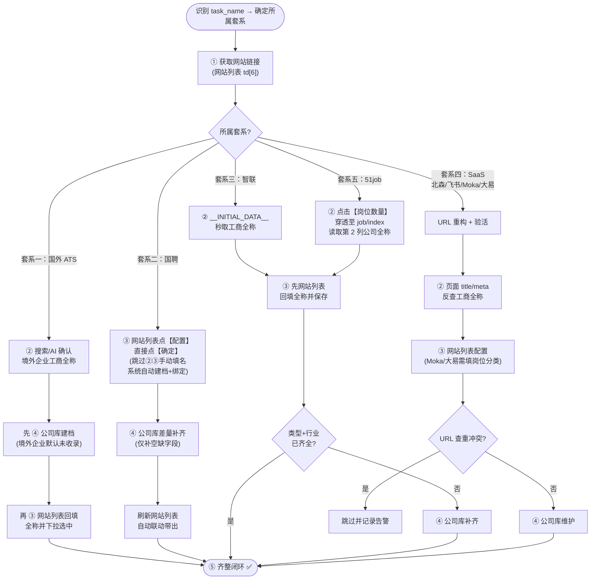

# 招聘网站 RPA 全自动配置与公司库录入系统操作手册

> [!CAUTION]
> ### 🚨 AI 角色铁律与极简三步作业流
> 1. **严禁编写任何 DOM 自动化临时脚本**：严禁临时编写 `check_xxx.py`、`inspect_xxx.py`、`test_xxx.py` 等去连接 CDP、查 DOM、点弹窗。所有操作由 runner 工具链完成。
> 2. **AI 的唯一职责（企业画像决策大脑）**：拿到待办 URL 后，反查法定工商全称、规范简称、定性企业类型、对齐 40 项行业代码，填入标准 JSON。
> 3. **人机协同三步流**：
>    - **Step 1 (脚本读)**：执行 runner `--scan-only`，导出待办 `xxx_companies.json`；
>    - **Step 2 (AI 查)**：AI 补齐 JSON 中的企业画像（全称、简称、类型、行业）；
>    - **Step 3 (脚本填)**：执行 `python xxx_runner.py --file xxx_companies.json`，全自动批量回填。
> 4. **单步调试**：仅允许 `rpa_engine.py auto-close` 或 `rpa_engine.py inspect`。

---

## 目录
- [一、通用闭环流程（所有套系的统一主干）](#一通用闭环流程所有套系的统一主干)
- [二、各平台分支规则（仅写差异）](#二各平台分支规则仅写差异)
- [三、数据标准与字典参考](#三数据标准与字典参考)
- [四、脚本与命令速查](#四脚本与命令速查)
- [五、DOM 与 Vue 交互速查手册](#五dom-与-vue-交互速查手册)

---

## 一、通用闭环流程（所有套系的统一主干）

### 1. 五步通用主干与分支流程图

所有套系都遵循同一条主干，区别仅在于**执行顺序**、**某些步骤可跳过**、**平台专属附加操作**：



---

### 2. 套系差异速查矩阵

| 套系 | 代表平台 | 步骤② 获取全称方式 | 步骤③④ 执行顺序 | 可跳过的步骤 | 专属附加操作 |
| :--- | :--- | :--- | :--- | :--- | :--- |
| **一：国外 ATS** | Greenhouse, Workday, Lever 等 | AI/人工搜索确认 | **先④建档 → 再③回填** | 无 | 中英简称拼装、境外企业/外商独资判定 |
| **二：国聘网** | `guopin_v3_spider_task` | 系统自带（自动建档） | ③直接点确定 → ④补齐 → 刷新 | **跳过②③手动填名** | 信用代码+地址自动带出；**类型与行业100%直接取自页面头部 `.company-attrs-item` 原生标签，严禁外部盲搜** |
| **三：智联招聘** | `zhao_pin_spider_task` | `__INITIAL_DATA__` 秒读 | **先③回填 → 按需④补齐** | **齐全时跳过④公司库** | 子机构名称陷阱规避 |
| **四：SaaS** | 北森/飞书/Moka/大易Wecruit | 页面 title/meta/关于 反查 | ③网站配置 → ④公司库 | 冲突时跳过④ | URL 重构验活、Moka 与大易 Wecruit 岗位分类（0校招/1实习/2社招） |
| **五：51job** | `five_one_job_spider_task` | 点击岗位数量穿透 | 同智联（先③后④） | 齐全时跳过④ | 岗位数量穿透取名 |

---

### 3. 核心铁律（所有套系通用）

> [!IMPORTANT]
> 1. **严禁行号定位（防并发位移）**：多爬虫并发向头部插入，`nth(i)` 必错位！必须用不可变业务主键（企业ID/完整URL）动态寻行 + 弹窗内 URL 签名强断言熔断（详见专项规程：[`RPA_Postmortem_and_Anti_Mismatch_Protocol.md`](file:///D:/100_Work/101_Program/Proj/XHS/rpa_company_fill/RPA_Postmortem_and_Anti_Mismatch_Protocol.md)）。
> 2. **已有数据绝对保护（差量补齐）**：已有非空地址绝不修改；已有正确类型（如"央企, 国企"复合标签）绝不重选。
> 3. **公司名称必须工商全称**：严禁简称、别称或二级部门名（如"xx 分行"）。
> 4. **岗位分类仅 Moka 与大易 Wecruit 有**：`moka_spider_task` 与 `wecruit_spider_task` 弹窗独有（`0`校招 / `1`实习 / `2`社招），其他平台严禁填入。
> 5. **【核心认知纠偏】网站列表联动失败直接跳过**：当发现企业在公司库明明已收录/新增，但网站列表刷新后类型与行业依然出不来时（底层原因是系统需要点击网站名称穿透跳转到公司列表去处理空绑定，交互过于复杂且容易引发副作用），**切忌死磕复杂联动流程，一律直接跳过该任务**，并在总结报告中单列汇报即可！
> 6. **【绝对红线】有效岗位验活铁律（无岗位严禁回填，熔断跳过留给用户）**：
>    - 对于任何构造/重构后的招聘列表页网址（尤其是北森 `*.zhiye.com/campus/jobs`、大易 `*.hotjob.cn/...` 等 SaaS 门户）：
>    - **必须在页面中实际探测核验是否存在有效在招岗位！**
>    - **若页面打开后职位数为 0（特征：显示“全部职位（共 0 个）”、“暂时没有符合条件的职位”、“暂无在招职位”、“0 个结果”等），绝对禁止将该 URL 强行填入或保存！**
>    - **处置方案**：一旦检测到无岗位，立即触发熔断机制，放弃修改，直接跳过该任务并保持原始状态，在最终报告中向用户单列汇报：“【企业全称】重构网址暂无在招岗位，已依规跳过，留给用户人工核实”。

> [!WARNING]
> #### 地址保护绝对铁律
> - 已有地址（含详细门牌号）**100% 原样保留**，严禁覆盖或缩写；
> - 地址为空时仅填地级市（如"深圳"），严禁编造门牌号；
> - CLI 参数默认空字符串 `""`，严禁 `"北京"` 等兜底默认值。

---

### 4. 通用操作：公司库查重与编辑/新增（/#/company-basic/index）

所有套系在步骤④中最终都执行同一套公司库操作：

#### 步骤 1：查重搜索
1. 定位搜索框：`input[placeholder*='输入关键词搜索']`；
2. 清空并填入**工商全称**；
3. 点击【搜索】，等待表格刷新。

#### 步骤 2：三种情况分支

- **情况 A：已收录且信息完全正确** → **直接跳过，秒切下一家！** 严禁重复编辑。

- **情况 B：已收录但字段残缺（真·差量补充原则：已有非空值 100% 绝对保护，绝不覆盖，仅补空缺项！）**
  - **🚨 核心操作顺序铁律（先行业，后类型）**：
    > **底层机理**：Element UI 的 Cascader（所属行业）级联组件高度敏感，易受表单 focus/blur 和下拉遮罩影响。若先操作 Select（企业类型），极易导致后续行业注入被吞噬失效！因此必须**绝对遵循：先注入行业，再处理类型**！
  - **1. 简称为空时**：补充填入规范简称；已有简称合理时保持原样；
  - **2. 行业为空时**：**优先**调用 `inject_industry_safely` 注入官方 40 项 ID 并触发事件；已有行业 100% 保持原样；
  - **3. 类型为空时**：在行业注入完成后，方可按需调用 `set_clean_org_type` 注入；**🚨 已有非空类型（尤其是复合标签如“央企, 国企”、“中外合资, 上市”）绝对保护，严禁触碰与重置覆盖！**
  - **4. 地址为空时**：补充总部地级市；**🚨 已有非空地址（含门牌号）100% 绝对保护，绝不缩写覆盖！**
  - 点击【确 定】，等待 `.v-modal` 遮罩层销毁。

- **情况 C：未收录（新企业）** → 点击【新增公司】→【手动新增】，依次填写：
  1. **名称**：`input[placeholder*='请输入名称']` → 工商全称；
  2. **简称**：`input[placeholder*='请输入简称']` → 规范简称；
  3. **地点**：`input[placeholder*='请输入地点']` → 标准地点；
  4. **行业**：**（核心顺位先行）** `inject_industry_safely` 注入；
  5. **类型**：`set_clean_org_type` 注入；
  6. 点击【确 定】保存。

#### 字段差量核验标准

| 检查字段 | 为空（""）时处理动作 | 已有非空值时的铁律约束 |
| :--- | :--- | :--- |
| **公司名称** | 填入工商注册全称 | 核验是否最新有效一级法人全称 |
| **规范简称** | 补充规范简称 | **原样保留**，避免频繁变更 |
| **企业类型** | 按画像补充填入 | **100% 绝对保护**，复合标签严禁单选覆盖重设 |
| **所属行业** | 注入官方 40 项 ID 并触发事件 | **100% 绝对保护**，已有行业严禁覆盖 |
| **注册地址** | 仅填总部地级市（如"深圳"） | **100% 绝对保护**，法定详细地址绝不覆盖篡改 |

---

### 5. 通用操作：网站列表配置回填（/#/company/index）

所有套系在步骤③中最终都执行同一套网站配置操作（国聘除外，国聘只需直接点确定）：

1. **URL 动态寻行**（严禁固定行号）：
   ```python
   matched_row = page_site.locator(".el-table__body-wrapper tbody tr").filter(
       has=page_site.locator(f"td:has-text('{target_url}')")
   ).first
   ```
2. **点击【配置】** 唤出弹窗；
3. **弹窗 URL 熔断校验**：读取弹窗内 `input[placeholder='请输入网站链接']`，若与 `target_url` 不一致，立即关闭放弃；
4. **（可选/按需）替换网站链接**：
   - 若该平台链接需要规范化重构（如 SaaS 平台单岗位/根域名重构、51job 替换为公开详情页等），且**已根据实际情况页面验活无误**；
   - 在弹窗的 `input[placeholder*='请输入网站链接']` 中清空并填入新的标准 URL；
   - ⚠️ 必须根据实际情况验证可用（HTTP 200 且非 404/notoken），严禁盲填未经验证的死链。
5. **填入公司全称**：`input[placeholder*='请输入公司名称']` 填入工商全称，从下拉建议中点击匹配项；
6. **（Moka 与大易 Wecruit 专属）填入岗位分类**：`input[placeholder*='0 校招']`（label 为【岗位分类：】）填入 `0`（校招）/ `1`（实习）/ `2`（社招）；
7. **点击【确 定】** 保存，监听 `更新成功！` 通知；
8. **闭环核验与极速省步跳转（第一性死律）**：
   - 保存完成后，**立即动态读取当前行第 3 列【公司类型】与第 4 列【所属行业】**；
   - **若均已非空（完整带出）**：证明后台已有完备档案且已自动联动，**当前任务直接宣布【✅ 齐整闭环】，立即退出！严禁再次访问公司库！**（彻底杜绝无谓页面往返及误改风险）；
   - **若任一字段为空**：说明后台档案缺失，方可进入步骤④前往公司库进行针对性差量补齐。

---

### 6. 公司库全量翻页自查规程

> [!WARNING]
> **搜索状态与分页互斥**：翻页巡检前必须先清空搜索框并点击搜索，恢复大盘模式（14,000+ 条），否则分页器处于搜索子集中无法翻页。

跳转指定页码：`.el-pagination__jump input` 填入页码并回车。

---

## 二、各平台分支规则（仅写差异）

> 以下各节仅描述相对于[通用主干](#1-五步通用主干与分支流程图)的**差异点**，通用操作不再重复。

---

### 🌐 套系一：国外主流 ATS

#### 1. 适用 task_name

| 任务标识 | ATS 平台 | URL 域名特征 |
| :--- | :--- | :--- |
| `green_house_spider_task` | Greenhouse | `boards.greenhouse.io` |
| `workday_spider_task` | Workday | `*.myworkdayjobs.com` |
| `smart_spider_task` | SmartRecruiters | `jobs.smartrecruiters.com` |
| `lever_spider_task` | Lever | `jobs.lever.co` |
| `oracle_hcm_spider_task` | Oracle HCM | `*.oraclecloud.com/hcmUI/...` |
| `taleo_spider_task` | Oracle Taleo | `*.taleo.net` |
| `ashby_spider_task` | Ashby | `jobs.ashbyhq.com` |
| `icims_spider_task` | iCIMS | `*.icims.com` |
| `eight_fold_spider_task` | Eightfold | `*.eightfold.ai` |

#### 2. 关键差异：执行顺序与画像规则

- **执行顺序反转**：境外企业公司库默认未收录，必须**先④公司库建档 → 再③网站回填**（否则下拉框找不到）。

- **公司类型与地点判定**：

| 企业属性 | 【类型】 | 【地点】 | 示例 |
| :--- | :--- | :--- | :--- |
| 纯境外（中国无法人） | **境外企业** | 海外总部**国家名**（如"美国"） | `West Virginia University` → 美国 |
| 外商在华法人 | **外商独资** | 中国**城市名**（如"上海"） | `荷美尔（中国）投资有限公司` → 上海 |

- **简称中英拼装规则**：中文名 + 英文原名紧贴，中间严禁空格/斜杠/横杠/括号。
  - 有公认中文名：`荷美尔Hormel`、`艾默生Emerson`、`世坤投资WorldQuant`
  - 无公认中文名（音译）：`西弗吉尼亚大学医疗WVUMedicine`、`赛凡物流Syfan`

---

### 🇨🇳 套系二：国聘网

#### 1. 适用 task_name
| 任务标识 | URL 域名特征 | 适用类型 |
| :--- | :--- | :--- |
| `guopin_v3_spider_task` | `https://www.iguopin.com/company?id=...` | 央企/国企/事业单位/民企等 |

#### 2. 关键差异：跳过步骤②③，直接点确定

- **步骤②③合并为一步**：在网站列表点击【配置】后，**无需修改任何内容，直接点【确 定】**。
- **底层原理**：国聘平台点击确定后，系统自动触发建档，自动带出**统一社会信用代码**与**注册地址**，建立底层外键绑定。
- **步骤④差量补齐**：进公司库搜索该企业，仅补齐空缺的简称/类型/行业。大部分时候类型与行业为空需要补，但已有地址与信用代码**绝不修改**。
- **闭环方式**：公司库补齐后回网站列表 `reload()` 刷新即可，**严禁二次回写点击**。

> [!WARNING]
> #### 网站列表未联动带出时直接跳过（免复杂穿透）
> 若在公司库已存在或已补齐，但网站列表 `reload()` 刷新后类型与行业仍未显现出来：
> - 底层虽然可通过“点击网站名称跳转到公司列表去处理空绑定”，但操作链路过于复杂脆弱；
> - **因此一律直接跳过该行任务，绝不再次强行配置或死磕，保持原样并在总结报告中明确列出即可**。

#### 3. 🚨 国聘原生企业画像提取铁律（第一数据源黄金准则）

> [!IMPORTANT]
> **严禁外部盲目搜索猜测**：
> 国聘作为国家级人才招聘平台，入驻企业已由平台完成前置营业执照和企业性质严格核验。
> 其企业主页（URL 形如 `https://www.iguopin.com/company?id=...`）头部区域**已原生给出最权威的企业性质、所属行业与规模**！
> 差量补齐或核验企业画像时，**国聘原生详情页是最高优先级的第一数据源，绝对禁止外部搜索引擎盲目推测**！

##### DOM 结构与字段映射规范

打开该企业的国聘页面（如通过 headless 页面或接口访问）：
```html
<div class="company-banner">
  <div class="company-info">
    <div class="company-name">厦门金龙旅行车有限公司</div>
    <div class="company-attrs">
      <span class="company-attrs-item">国企</span>
      <span class="company-attrs-item">汽车制造业</span>
      <span class="company-attrs-item">2000-5000人</span>
    </div>
  </div>
</div>
```

- **容器定位**：`.company-attrs`
- **属性标签集**：`.company-attrs .company-attrs-item`
  1. **第 1 项（企业性质）`item[0]`**：
     - 原生标注 `央企` ➡️ 后台类型选择 `央企`
     - 原生标注 `国企` ➡️ 后台类型选择 `国企`
     - 原生标注 `民企` / `民营企业` ➡️ 后台类型选择 `民企`
     - 原生标注 `上市公司` ➡️ 后台类型选择 `上市`
     - 原生标注 `外企` / `外商独资` ➡️ 后台类型选择 `外商独资`
     - 原生标注 `合资` / `中外合资` ➡️ 后台类型选择 `中外合资`
     - 原生标注 `事业单位` ➡️ 后台类型选择 `事业单位`
  2. **第 2 项（所属行业）`item[1]`**：
     - 读取原生行业名称（如 `汽车制造业`、`计算机/通信`、`教育`、`生物医药` 等），直接精准对齐后台 40 项官方标准行业（如 `汽车/智能驾驶`、`硬件/半导体/芯片`、`教育`、`生物/医疗/制药` 等）。
  3. **第 3 项（人员规模）`item[2]`**：
     - 用于辅助核验企业体量。
- **法定注册地址与简介**：
  - 页面下方【单位地址】与【更多信息】直接展示法定注册地及注册资金，但由于 Stage 1 网站列表点击【确定】已触发系统自动建档写入，**公司库已有地址 100% 差量保护，严禁二次篡改**。

---

### 💼 套系三：智联招聘

#### 1. 适用 task_name
| 任务标识 | URL 域名特征 | 适用类型 |
| :--- | :--- | :--- |
| `zhao_pin_spider_task` | `https://xiaoyuan.zhaopin.com/company/...` | 央企/国企/上市/民企等 |

#### 2. 关键差异：先回填省步 + `__INITIAL_DATA__` 取名

- **步骤②取全称技巧**：智联页面在 `window.__INITIAL_DATA__` 中挂载完整企业档案：
  ```javascript
  const companyBase = window.__INITIAL_DATA__?.company?.companyState?.companyBase;
  const fullName = companyBase?.campusCompanyName || companyBase?.campusOrgName;
  ```
  `campusCompanyName` 是真正的一级法人全称（如"中国邮政集团有限公司"）。

- **步骤③④省步打法**：获取全称后**直接先③网站回填**。智联所涉国内企业后台已有档案比例极高（>80%），回填后系统自动联动带出类型+行业，**齐全时直接闭环跳过④**，省去 50% 以上交互。

#### 3. 核心避坑

- **子机构名称陷阱**：页面 DOM（`.company-name`）常展示的是下级分公司（如"总行本部"、"北京分公司"），直接读取会严重失真。**必须用 `__INITIAL_DATA__` 读取**。
- **独立子公司判断**：若 `campusCompanyName` 为简称（如"中邮投资"），需从页面简介首句提取法定全称（如"中邮金融资产投资有限公司"）。
- **科研院所**：如"中国航发控制系统研究所"为事业单位法人，类型选 `事业单位`（`'10'`），行业选 `军工/航天/航空`（`['16']`）。

---

### 🧪 套系四：国内四大 SaaS（北森 / 飞书 / Moka / 大易 Wecruit）

> ⚠️ 本套系处于**探索与实验验证阶段**，核心痛点是单岗位死链、URL 需重构清洗。

#### 1. 关键差异：URL 重构 + 验活 + 查重冲突

- **步骤③前置操作**：原始爬虫 URL 往往是单岗位详情死链，必须先重构为标准列表页 URL，再验活确认可用后方可回填。
- **查重冲突处理**：若触发"更新失败：存在相同的网站"，点确定跳过，记录告警，**不操作公司库**（避免孤儿脏数据）。
- **Moka 与大易 Wecruit 专属**：配置弹窗中必须同步填写**岗位分类**（`0`校招 / `1`实习 / `2`社招），其他平台无此字段。

#### 2. 四大平台 URL 重构规则

| 平台 | 典型域名 | 脏链接特征 | 正确标准列表页 | 重构规则 |
| :--- | :--- | :--- | :--- | :--- |
| **北森** `beisen_spider_task` | `*.zhiye.com` | **① 纯根域名/门户页**：`https://{slug}.zhiye.com[/]`<br>**② 单岗位详情页**：`/{channel}/detail?jobAdId=...` | `/{channel}/jobs` | **严禁只留根域名！**<br>① 纯根域名必须强制追加并验活 `https://{slug}.zhiye.com/campus/jobs`（校招优先）或 `/social/jobs`；<br>② 单岗位必须截断 `/detail`，重构为 `/{channel}/jobs` |
| **飞书** `feishu_spider_task` | `*.jobs.feishu.cn` | `/referral/.../detail`（踢至 notoken）<br>`/{channel}/position/{id}/detail` | `/{channel}/position/list` 或 `/index` | 保留频道，重写为 `/position/list`；**切忌盲改 `/index`**（子频道无 index 会 404） |
| **Moka** `moka_spider_task` | `app.mokahr.com` | `#/job`（缺 s）<br>`#/job/{id}/apply` | `?locale=zh-CN#/jobs` | **保留 Query**，Hash 统一为 `#/jobs`（带 s） |
| **大易 Wecruit** `wecruit_spider_task` | `wecruit.hotjob.cn` / `*.hotjob.cn` | **① 单岗位死链/投递页**<br>**② 移动端微官网根路径**：`/{tenant}/mc/index`<br>**③ 缺省频道入口**：`/{tenant}/pb/index` | **校招首选**：`/{tenant}/pb/school.html`<br>**社招退守**：`/{tenant}/mc/position/society` | **校招优先，社招退守！**<br>① 优先重构为 PC 端标准校招页 `/pb/school.html`，岗位分类填 `0`；<br>② 若验活无校招职位或 404，退而求其次选择社招 `/mc/position/society`，岗位分类填 `2` |

#### 3. 全称反查方式
- **飞书**：`document.title` 格式为 `加入[工商全称]`；或 `<meta name="description">` 含 `到[工商全称]，开启你的新工作`。
- **北森/Moka**：页面页脚或标题提取。
- **大易 Wecruit**：页面 `document.title`，或点击页面 Logo / 查看“关于我们”及页脚版权信息提取工商全称。

#### 4. URL 重构典型样本（每平台代表）

**北森**：
| 原始链接 | 标准链接 | 说明 |
| :--- | :--- | :--- |
| `https://anmei.zhiye.com` | `https://anmei.zhiye.com/campus/jobs` | ❌ **纯根域名（致命失误）**，爬虫无职位列表，必须强制追加 `/campus/jobs` |
| `http://aspire.zhiye.com/campus/detail?jobAdId=e731...` | `https://aspire.zhiye.com/campus/jobs` | ❌ 单岗位详情，剥离重构为列表页 |
| `https://dcprecision1.zhiye.com/campus/jobs` | 同左 | ✅ 已标准（含 `/campus/jobs` 或 `/social/jobs`） |

**飞书**：
| 原始链接 | 标准链接 | 说明 |
| :--- | :--- | :--- |
| `https://sen-asic.jobs.feishu.cn/index` | 同左 | ✅ 门户入口 |
| `https://yanqugame.jobs.feishu.cn/xz/position/7645.../detail` | `https://yanqugame.jobs.feishu.cn/xz/position/list` | ❌ 保留 `/xz/`，改 `/position/list` |
| `https://hr-jobs.sensetime.com/exp/` | 同左 | ✅ 独立域名保留频道入口 |
| `https://jobs.usmile.com/referral/position/list` | `https://jobs.usmile.com/index/position/list` | ❌ 内推路由 404，重构为 `/index/position/list`（星际悦动 46 岗位有效） |
| `http://job.sccrun.com/JobCenter/position/list` | `http://job.sccrun.com/` | ❌ 自定义中心 404，重构为独立域名根门户（川润股份 31 岗位有效） |


**Moka**：
| 原始链接 | 标准链接 | 说明 |
| :--- | :--- | :--- |
| `https://app.mokahr.com/campus-recruitment/xingyealloy/170609?locale=zh-CN#/jobs` | 同左 | ✅ 标准校招列表 |
| `https://hire-r1.mokahr.com/apply/tripoverseas/100000877#/job` | `...#/jobs` | ⚠️ `#/job` 缺 s，修复 |
| `https://app.mokahr.com/social-recruitment/ruien/140573?locale=zh-CN#/job/4b33.../apply` | `...?locale=zh-CN#/jobs` | ❌ 单岗位投递死链，保留 locale，重写 `#/jobs` |

**大易 Wecruit**：
| 原始链接 | 标准链接 | 岗位分类 | 说明 |
| :--- | :--- | :--- | :--- |
| `https://wecruit.hotjob.cn/SU64ccae171c240e7cb6c43b51/mc/index` | `https://wecruit.hotjob.cn/SU64ccae171c240e7cb6c43b51/pb/school.html` | `0` (校招) | 移动端微官网，优先重构为 PC 端标准校招列表页（中车哈尔滨车辆） |
| `https://wecruit.hotjob.cn/SU6a5f1fabba2dc64cbb887983/pb/index` | `https://wecruit.hotjob.cn/SU6a5f1fabba2dc64cbb887983/pb/school.html` | `0` (校招) | 缺省频道入口，规整为标准校招页（双胞胎集团） |
| `https://wecruit.hotjob.cn/SU678f4d126202cc5bfb83d6ea/pb/school.html` | 同左 | `0` (校招) | 已标准校招页，保留并填分类 0（诺斯贝尔） |
| `https://wecruit.hotjob.cn/SU66c20abb1c240e39b5c2ff61/mc/position/...` | `https://wecruit.hotjob.cn/SU66c20abb1c240e39b5c2ff61/mc/position/society` | `2` (社招) | 无校招职位，退而求其次重构为标准社招列表（中国二重） |
| `https://wecruit.hotjob.cn/SU60122eb35d83dc11e4a78c1f/mc/detail?...recruitType=campus` | `https://wecruit.hotjob.cn/SU60122eb35d83dc11e4a78c1f/mc/position/campus` | `0` (校招) | PC端未配置时，移动端校招列表路径为 `/mc/position/campus`（广州越秀农牧食品） |

#### 5. 验活函数（Validation Gate）

推测 URL 后**必须实际页面验证**，防止把半残单岗位升级为彻底 404 死链：

```python
def validate_reconstructed_url(page_headless, candidate_url, original_url=None):
    """
    返回: { 'ok': bool, 'status': int, 'title': str, 'final_url': str,
            'detected_company': str, 'msg': str }
    """
    try:
        resp = page_headless.goto(candidate_url, timeout=12000, wait_until="domcontentloaded")
        page_headless.wait_for_timeout(1500)
        status_code = resp.status if resp else 200
        final_url = page_headless.url
        title = page_headless.title().strip().replace("\n", " ")

        if status_code >= 400:
            return {'ok': False, 'status': status_code, 'title': title, 'final_url': final_url,
                    'detected_company': '', 'msg': f'HTTP状态码异常: {status_code}'}
        if "notoken" in final_url or "error" in final_url or "404" in final_url:
            return {'ok': False, 'status': status_code, 'title': title, 'final_url': final_url,
                    'detected_company': '', 'msg': '被重定向到失效错误页'}
        if any(kw in title for kw in ["页面不存在", "找不到页面", "404", "Not Found", "出错了"]):
            return {'ok': False, 'status': status_code, 'title': title, 'final_url': final_url,
                    'detected_company': '', 'msg': f'页面标题异常: {title}'}

        # 🚨【规则 6 核心拦截】：校验页面是否包含有效在招岗位
        page_text = page_headless.inner_text("body")
        empty_job_keywords = [
            "全部职位（共 0 个）", "全部职位(共0个)", "共 0 个职位", "共0个职位",
            "暂时没有符合条件的职位", "暂无符合条件的职位", "暂无在招职位", "暂无职位",
            "在招职位 0", "在招职位0", "在招职位（0）", "0 个结果", "未找到相关职位"
        ]
        if any(kw in page_text for kw in empty_job_keywords):
            return {'ok': False, 'status': status_code, 'title': title, 'final_url': final_url,
                    'detected_company': '', 'msg': '❌ 页面无在招岗位（职位数量为0），触发规则6熔断跳过！'}

        detected_company = ""
        if title.startswith("加入") and " - " in title:
            detected_company = title.split(" - ")[-1].replace("加入", "").strip()
        elif title.startswith("加入"):
            detected_company = title.replace("加入", "").strip()

        return {'ok': True, 'status': status_code, 'title': title, 'final_url': final_url,
                'detected_company': detected_company, 'msg': '✅ 验证通过（在招岗位存在且有效），可安全回填！'}
    except Exception as e:
        return {'ok': False, 'status': 0, 'title': '', 'final_url': candidate_url,
                'detected_company': '', 'msg': f'访问异常: {str(e)[:60]}'}
```

---

### 🎯 套系五：前程无忧 / 应届生求职网

#### 1. 适用 task_name
| 任务标识 | 平台 |
| :--- | :--- |
| `five_one_job_spider_task` | 前程无忧 51job / 应届生求职网 |

#### 2. 关键差异：岗位数量穿透取名

- **核心痛点**：原始 URL 是网申简历填写页（`xyz.51job.com/.../FillInResume.aspx`），未登录会被 302 踢至登录页，**页面 DOM 中完全无企业名称**。

- **破局方式（官方黄金通道）**：
  1. 先检查网站列表原表 `td[1]`（网站名称），若爬虫已填入全称可直接使用；
  2. 若缺失：直接调用引擎已固化命令：
     ```powershell
     python rpa_engine.py probe-51job --page 1 --row 4
     ```
     该命令全自动点击第 5 列【岗位数量】穿透跳转至 `/#/job/index`，秒级提取法定全称与应届生职位链接，并自动切回网站列表；
  3. 若第 5 列【岗位数量】显示为 0，或穿透后详情列表无在招职位，**坚决执行【铁律 6 熔断跳过】**，原样保留并向用户单列汇报，严禁强行建档回填；
  4. 取得有效全称后，切回网站列表按通用步骤③回填。

- **公开详情页解析**：`q.yingjiesheng.com/jobdetail/{id}.html` 标题格式为 `【{岗位名}招聘】_{企业全称}招聘信息-应届生求职网`，提取正则：`re.search(r"】_(.*?)招聘信息", title)`。


---

## 三、数据标准与字典参考

### 1. 全量 40 项行业标准映射与 Vue ID 字典

注入格式：`['<ID>']`（如快消为 `['4']`，智能家居为 `['35']`）。

| # | 行业名称 | ID | # | 行业名称 | ID |
| :--- | :--- | :--- | :--- | :--- | :--- |
| 1 | IT/互联网/游戏 | `['0']` | 21 | 批发零售 | `['21']` |
| 2 | 金融业 | `['1']` | 22 | 科研技术 | `['22']` |
| 3 | 专业服务 | `['2']` | 23 | 新闻出版 | `['23']` |
| 4 | 广告传媒/文化体育 | `['3']` | 24 | 烟草 | `['24']` |
| 5 | 快消 | `['4']` | 25 | 电子商务 | `['25']` |
| 6 | 生物/医疗/制药 | `['5']` | 26 | 船舶 | `['26']` |
| 7 | 硬件/半导体/芯片 | `['6']` | 27 | 机器人 | `['27']` |
| 8 | 汽车/智能驾驶 | `['7']` | 28 | 人工智能 | `['28']` |
| 9 | 物流/供应链/交通运输 | `['8']` | 29 | 云计算 | `['29']` |
| 10 | 建筑/房地产 | `['9']` | 30 | 生活服务 | `['30']` |
| 11 | 机械/制造业 | `['10']` | 31 | 新能源 | `['31']` |
| 12 | 材料/能源/化工 | `['11']` | 32 | 大数据 | `['32']` |
| 13 | 政府机关 | `['12']` | 33 | 消费电子 | `['33']` |
| 14 | 综合 | `['13']` | 34 | 智能家居 | `['35']` |
| 15 | 环保 | `['15']` | 35 | 商业服务 | `['36']` |
| 16 | 军工/航天/航空 | `['16']` | 36 | 低空经济 | `['37']` |
| 17 | 通信 | `['17']` | 37 | 区块链 | `['38']` |
| 18 | 农林牧渔 | `['18']` | 38 | 奢侈品 | `['39']` |
| 19 | 教育 | `['19']` | 39 | 其它 | `['41']` |
| 20 | 餐饮住宿 | `['20']` | 40 | 社会组织 | `['42']` |

> 📌 `34` 是【机械/制造业】下的二级分类【家用电器】；真正的【智能家居】为一级分类，编码是 **`35`**。

---

### 2. 企业类型 18 项 Value 字典

```json
{
  "央企": "0", "国企": "1", "外商独资": "2", "民企": "3", "上市": "4",
  "律所": "5", "医院": "6", "学校": "7", "银行": "8", "国家机关": "9",
  "事业单位": "10", "中外合资": "13", "其他股份有限公司": "14",
  "会计师事务所": "15", "中外合作": "16", "其他有限责任公司": "17",
  "境外企业": "18", "招聘会来源": "19"
}
```

---

### 3. 标准 JSON 中间文件结构

统一保存路径：`D:\100_Work\101_Program\Proj\XHS\rpa_company_fill\foreign_companies.json`

```json
[
  {
    "公司名称": "West Virginia University Health System",
    "简称": "西弗吉尼亚大学医疗WVUMedicine",
    "类型": "境外企业",
    "行业": "生物/医疗/制药",
    "地点": "美国",
    "网站链接": "https://wvumedicine.wd1.myworkdayjobs.com/en-US/WVUH"
  }
]
```

---

### 4. 岗位分类（仅 Moka）
* `0` → 校招（应届生、管培生）
* `1` → 实习（在校实习生、暑期实习）
* `2` → 社招（社会招聘、成熟人才）

---

### 5. 各平台 URL 标准化重构与岗位分类映射表

| 平台任务标识 | 类型 | 岗位分类 | 标准 URL 格式 |
| :--- | :---: | :---: | :--- |
| **Moka** `moka_spider_task` | 校招 | **`0`** | `https://app.mokahr.com/campus-recruitment/{org}/{id}?{query}#/jobs` |
| **Moka** `moka_spider_task` | 社招 | **`2`** | `https://app.mokahr.com/social-recruitment/{org}/{id}?{query}#/jobs` |
| **Moka** `moka_spider_task` | 实习 | **`1`** | `https://app.mokahr.com/.../jobs` |
| **北森** `beisen_spider_task` | 校招 | 无 | `https://{slug}.zhiye.com/campus/jobs` |
| **北森** `beisen_spider_task` | 社招 | 无 | `https://{slug}.zhiye.com/social/jobs` |
| **飞书** `feishu_spider_task` | 通用 | 无 | `https://{slug}.jobs.feishu.cn/{channel}/position/list` |
| **智联** `zhao_pin_spider_task` | 校招 | 无 | 原样保持 `xiaoyuan.zhaopin.com` |
| **国聘** `guopin_v3_spider_task` | 通用 | 无 | 原样保持 `www.iguopin.com/company?id=...` |
| **51job** `five_one_job_spider_task` | 校招 | 无 | `https://q.yingjiesheng.com/jobdetail/{id}.html`（从岗位数量穿透获取） |
| **国外 ATS** 各类 | 通用 | 无 | 剥离单岗位参数，保留列表路由 |

---

## 四、脚本与命令速查

### 1. 前置环境
```powershell
# 启动 Chrome CDP
& "C:\Program Files\Google\Chrome\Application\chrome.exe" --remote-debugging-port=9222
```
确保打开两个标签页：
- `http://admin.jobleap.betaquantity.com/#/company/index`（网站列表）
- `http://admin.jobleap.betaquantity.com/#/company-basic/index`（公司库）

---

### 2. 核心引擎 `rpa_engine.py` 命令速查

```powershell
# 只读检视当前页 / 指定页
python rpa_engine.py inspect
python rpa_engine.py inspect --page 2

# 招聘链接无头探针验活（探测 Title、有效在招职位数量及摘要，排查 404/死链）
python rpa_engine.py probe-url --url "https://nanfangpump.zhiye.com/campus/jobs"

# 51job/应届生专招：穿透第 5 列【岗位数量】秒级提取一级公司全称与职位链接
python rpa_engine.py probe-51job --page 1 --row 4

# 公司库档案维护（查重→比对→差量编辑/新增，支持既有地址与类型 100% 绝对保护）
python rpa_engine.py ensure-company --name "公司全称" --abbr "简称" --type "民企" --industry "IT/互联网/游戏" --location "深圳"

# 公司库单项快速核查
python rpa_engine.py inspect-basic --search "得邦照明"

# 网站列表行配置（动态寻行 + URL替换 + 全称回填 + 岗位分类）
python rpa_engine.py configure-site --match "sirio" --new-url "https://app.mokahr.com/campus-recruitment/sirio/166467#/jobs" --company "仙乐健康科技股份有限公司" --category 0

# 端到端一键闭环（动态寻行 -> 网站配置 -> 极速判断联动 -> 按需公司库差量补录）
python rpa_engine.py auto-close --match "huitian1" --name "湖北回天新材料股份有限公司" --abbr "回天新材" --type "上市" --industry "材料/能源/化工" --location "襄阳" --new-url "https://huitian1.zhiye.com/campus/jobs" --category 0
```

---

### 3. 各 Runner 脚本

| 套系 | 脚本 | 执行命令 |
| :--- | :--- | :--- |
| **一：国外 ATS** | `universal_company_filler.py` | `python universal_company_filler.py [--file foreign_companies.json]` |
| **二：国聘** | `guopin_auto_runner.py` | `python guopin_auto_runner.py --file guopin_companies.json`（精准 JSON）<br>`python guopin_auto_runner.py --scan-only`（仅扫描导出）<br>`python guopin_auto_runner.py --pages 1`（全自动连续） |
| **三：智联** | `zhaopin_auto_runner.py` | `python zhaopin_auto_runner.py`（全自动端到端）<br>`python zhaopin_auto_runner.py --file zhaopin_companies.json`（JSON 驱动）<br>`python zhaopin_auto_runner.py --scan-only`（仅扫描导出） |

> 以上命令中 `python` 指 `d:\100_Work\101_Program\Proj\XHS\.venv\Scripts\python.exe -u`，脚本均位于 `D:\100_Work\101_Program\Proj\XHS\rpa_company_fill\`。

---

### 4. 正式文件清单

| 文件名 | 类型 | 说明 |
| :--- | :--- | :--- |
| `RPA_Guide.md` | 文档 | 唯一权威操作手册 |
| `rpa_engine.py` | 核心引擎 | 唯一官方固化执行引擎 |
| `real_industry_map.json` | 数据 | 官方真实行业字典（40 项） |
| `universal_company_filler.py` | 脚本 | 套系一：国外 ATS 闭环 |
| `guopin_auto_runner.py` | 脚本 | 套系二：国聘全自动闭环 |
| `zhaopin_auto_runner.py` | 脚本 | 套系三：智联全自动闭环 |

> 🚨 **严禁随手建临时脚本**（`check_xxx.py`、`inspect_xxx.py` 等），凡操作必用固化引擎或 runner。

---

### 5. 过程文件管理铁律

- **零临时文件滞留**：严禁在 `rpa_company_fill` 目录堆积 `probe_*.json`、`*_scan.json` 等中间文件；
- **内存处理优先**：能在内存中处理的数据禁止先写文件再读取；
- **白名单例外**：仅 `foreign_companies.json`、`guopin_companies.json`、`zhaopin_companies.json` 三个中间 JSON 允许暂存，任务完成后及时清理。

---

## 五、DOM 与 Vue 交互速查手册

> 💡 本章沉淀真实 DOM 结构、CSS 选择器、Vue Model 字段与事件派发机制。**直接调用，严禁盲目探索。**

---

### 1. 网站列表页 (`/#/company/index`) 选择器

#### 表格列索引
| `td` | 字段 | 用途 |
| :---: | :--- | :--- |
| `td[0]` | 序号 | 行号 |
| `td[1]` | 网站名称 | 展示名 |
| `td[2]` | 公司类型 | **闭环判定**：空需补充 |
| `td[3]` | 所属行业 | **闭环判定**：空需补充 |
| `td[4]` | 任务标识 | 判定套系 |
| `td[5]` | 运行频率 | — |
| `td[6]` | 网站链接 | **唯一匹配键** |
| `td[7]` | 创建时间 | — |
| `td[10]` | 操作列 | 配置/入库/删除等按钮 |

#### 核心选择器
| 组件 | 选择器 |
| :--- | :--- |
| 动态寻行 | `tr:has(td:has-text('{slug_or_url}'))` |
| 搜索框 | `input[placeholder*='输入关键词搜索']` |
| 搜索按钮 | `button:has-text('搜索')` |
| 翻页跳转 | `.el-pagination__jump input` |
| 行内【配置】 | `matched_row.locator("button:has-text('配置')").first` |
| 弹窗【网站链接】 | `input[placeholder*='请输入网站链接']` |
| 弹窗【公司名称】 | `input[placeholder*='请输入公司名称']` |
| 下拉建议项 | `.el-select-dropdown:visible .el-select-dropdown__item, .el-autocomplete-suggestion:visible li` |
| 弹窗【岗位分类】（仅 Moka） | `input[placeholder*='0 校招']` |
| 弹窗【确 定】 | `.el-dialog:visible button:has-text('确 定')` |
| 成功 Toast | `.el-message--success` |
| 遮罩层销毁 | `!document.querySelector('.v-modal')` |

---

### 2. 公司列表页 (`/#/company-basic/index`) 选择器

#### 表格列索引
| `td` | 字段 | 用途 |
| :---: | :--- | :--- |
| `td[0]` | 序号 | — |
| `td[1]` | 公司名称 | 查重核心键 |
| `td[2]` | 简称 | 空必补齐 |
| `td[3]` | 企业类型 | 核对并保护 |
| `td[4]` | 所属行业 | 对齐 40 项 |
| `td[5]` | 信用代码 | — |
| `td[6]` | 地址 | 已有绝不覆盖 |
| `td[7]` | 关联网站数 | — |
| `td[13]` | 操作列 | 编辑/详情等按钮 |

#### 核心选择器
| 组件 | 选择器 |
| :--- | :--- |
| 搜索框 | `input[placeholder*='输入关键词搜索']` |
| 搜索按钮 | `button:has-text('搜索')` |
| 行内【编辑】 | `tr.nth(i).locator("button:has-text('编辑')").first` |
| 【新增公司】 | `button:has-text('新增公司')` |
| 【手动新增】 | `button:has-text('手动新增')` |
| 表单【名称】 | `input[placeholder*='请输入名称']` |
| 表单【简称】 | `input[placeholder*='请输入简称']` |
| 表单【地点】 | `input[placeholder*='请输入地点']` |
| 弹窗【确 定】 | `.el-dialog:visible button:has-text('确 定')` |

---

### 3. 企业类型 `org_type_new` 注入规范

> ⚠️ 企业类型为 `multiple select`，UI 点选会**追加**而非替换，必须直接操作 Vue Model。

```python
def set_clean_org_type(page, type_id_list):
    """无残留强制覆盖企业类型（如民企 ['3']、境外企业 ['18']）"""
    page.evaluate("""(typeArr) => {
        const diag = Array.from(document.querySelectorAll('.el-dialog__wrapper'))
            .find(d => window.getComputedStyle(d).display !== 'none');
        if (!diag) return { ok: false };
        const form = diag.querySelector('.el-form');
        if (form && form.__vue__ && form.__vue__.model) {
            form.__vue__.model.org_type_new = typeArr;
            if (typeof form.__vue__.$set === 'function')
                form.__vue__.$set(form.__vue__.model, 'org_type_new', typeArr);
        }
        const select = diag.querySelector('.el-form-item .el-select');
        if (select && select.__vue__) {
            select.__vue__.$emit('input', typeArr);
            select.__vue__.$emit('change', typeArr);
        }
        return { ok: true, val: form ? form.__vue__.model.org_type_new : null };
    }""", type_id_list)
```

---

### 4. 所属行业 `industry_new` 注入规范

> ⚠️ Cascader 提交校验时若内部选中状态为空，会反向用空值覆盖 Model，**必须同时 Model 赋值 + 双派发事件**。

```python
def inject_industry_safely(page, industry_id_list):
    """安全注入行业 ID（如金融业 ['1']、机器人 ['27']）"""
    return page.evaluate("""(idArr) => {
        const diag = Array.from(document.querySelectorAll('.el-dialog__wrapper'))
            .find(d => window.getComputedStyle(d).display !== 'none');
        if (!diag) return { ok: false, msg: 'no dialog' };
        const form = diag.querySelector('.el-form');
        if (form && form.__vue__ && form.__vue__.model) {
            form.__vue__.model.industry_new = idArr;
            if (typeof form.__vue__.$set === 'function')
                form.__vue__.$set(form.__vue__.model, 'industry_new', idArr);
        }
        const cascader = diag.querySelector('.el-cascader');
        if (cascader && cascader.__vue__) {
            cascader.__vue__.$emit('input', idArr);
            cascader.__vue__.$emit('change', idArr);
        }
        return { ok: true, val: form ? form.__vue__.model.industry_new : null };
    }""", industry_id_list)
```

---

### 5. 弹窗与遮罩层函数

```python
def wait_modal_gone(page, timeout=5000):
    """等待遮罩层完全销毁"""
    try:
        page.wait_for_function("() => !document.querySelector('.v-modal')", timeout=timeout)
    except Exception:
        pass
    page.wait_for_timeout(300)

def close_visible_dialogs(page):
    """关闭所有残留可见弹窗"""
    try:
        page.evaluate("""() => {
            document.querySelectorAll('.el-dialog__wrapper').forEach(d => {
                if (window.getComputedStyle(d).display !== 'none') {
                    const btn = d.querySelector('.el-dialog__headerbtn');
                    if (btn) btn.click();
                }
            });
        }""")
        wait_modal_gone(page)
    except Exception:
        pass
```

---

### 6. 动态寻行与熔断机制

```python
def safely_configure_site_task(page_site, target_url, full_name):
    """URL 动态寻行 + 弹窗签名双向熔断校验"""
    # 1. 动态定位（绝不用固定行号）
    matched_row = page_site.locator(".el-table__body-wrapper tbody tr").filter(
        has=page_site.locator(f"td:has-text('{target_url}')")
    ).first
    if matched_row.count() == 0 or not matched_row.is_visible():
        print(f"  ❌ 当前页未找到 URL [{target_url}]")
        return False

    # 2. 点击配置
    matched_row.locator("button:has-text('配置')").first.click(force=True)
    page_site.wait_for_timeout(800)
    dialog = page_site.locator(".el-dialog:visible").last

    # 3. 熔断校验
    dialog_url = dialog.locator("input[placeholder='请输入网站链接']").first.input_value().strip()
    if dialog_url != target_url:
        print(f"  🚨 [熔断] 弹窗URL [{dialog_url}] != 目标 [{target_url}]，关闭！")
        dialog.locator(".el-dialog__headerbtn").click()
        page_site.wait_for_timeout(400)
        return False

    # 4. 回填全称
    comp_input = dialog.locator("input[placeholder='请输入公司名称']").first
    comp_input.fill("")
    comp_input.fill(full_name)
    page_site.wait_for_timeout(600)

    # 5. 点击下拉建议
    suggestion = page_site.locator(
        f".el-autocomplete-suggestion li:has-text('{full_name}'), "
        f".el-select-dropdown__item:has-text('{full_name}')"
    ).first
    if suggestion.count() > 0 and suggestion.is_visible():
        suggestion.click()
    else:
        comp_input.press("Enter")
    page_site.wait_for_timeout(300)

    # 6. 保存
    confirm_btn = dialog.locator(
        ".el-dialog__footer button:has-text('确'), button:has-text('确 定')"
    ).last
    confirm_btn.click(force=True)
    page_site.wait_for_timeout(1000)
    wait_modal_gone(page_site)
    print(f"  ✅ 【{full_name}】配置完成！")
    return True
```

---

### 7. 查重冲突自动跳过

当保存时触发 `更新失败：存在相同的网站...` 弹窗：
1. 自动捕获 `.el-message-box:visible`；
2. 点击弹窗【确定】；
3. 关闭残留配置对话框；
4. 跳过并记录，最终汇报。
