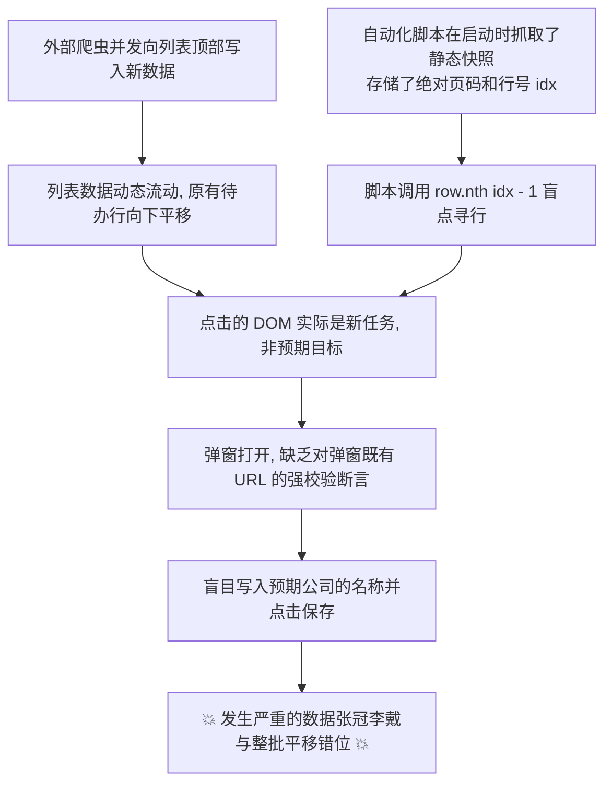

# RPA 自动化录入错位事故深度复盘与技术防范规程 (Postmortem & Protocol)

> **创建日期**：2026-10-01  
> **核心议题**：针对 2026-09-30 晚间国聘网（`guopin_v3_spider_task`）等任务录入中出现的“数据整批向下平移错位（Off-by-N Mismatch）”进行深度复盘与根因分析，并制定全流程防错技术标准。

---

## 一、 事故背景与现象还原

### 1. 现象描述
在 2026-09-30 晚间的批量处理中，后台系统自动接入了一批新的国聘爬虫任务。脚本在执行第 1 页至第 2 页国聘任务建档回填时，发生了**企业名称与目标招聘网址张冠李戴**的严重错位事故，导致多行记录的工商全称、企业性质与实际网址不匹配。

### 2. 真实数据错位对比表（只读复盘审计）

| 网站行号 / 国聘企业 ID | 订正后真实归属企业（正解） | 事故时脚本错误写入的企业名称 | 错位原因分析 |
| :--- | :--- | :--- | :--- |
| **`219469499856847410`** | **中国保险保障基金有限责任公司** | *北京市安全生产工程技术研究院* | ❌ 被填入后置目标名称（向下平移 1 位） |
| **`166561851268661940`** | **中国移动通信集团广东有限公司江门分公司** | *中国人民人寿保险股份有限公司苏州中心支公司* | ❌ 被填入后置目标名称 |
| **`10685386002219699`** | **江苏省苏豪控股集团有限公司** | *福建六融工业有限公司* | ❌ 被填入后置目标名称 |
| **`118180342245884090`** | **北京市安全生产工程技术研究院** | *上海亿普链信息科技有限公司* | ❌ 真实行在第 5 行，被当成了第 1 行盲点覆盖 |
| **`10685387495172326`** | **中国人民人寿保险股份有限公司苏州中心支公司** | *四川川投售电有限责任公司* | ❌ 整体向后错位平移 |

---

## 二、 第一性原理深度根因剖析（Root Cause Analysis）

立足于底层数据流与 DOM 渲染机理，事故发生的本质根因如下：



### 1. 致命缺陷一：依赖“静态行号（`nth(idx - 1)`）”，忽视了列表的“动态并发流动性”
- **机理**：后台任务列表是一个**实时并发流（Real-time Concurrent Stream）**，外部爬虫和调度服务随时可能向列表最前端插入新采集的任务；
- **错误代码**：
  ```python
  # ❌ 错误示范：抓取静态列表后，使用死板的行索引寻行
  row_el = page_site.locator(".el-table__body-wrapper tbody tr").nth(idx - 1)
  row_el.locator("button:has-text('配置')").first.click(force=True)
  ```
- **后果**：静态快照在生成的一瞬间就已经过时。当新记录插入顶部后，原本位于第 1 行的目标已顺延到了第 5 行，脚本点击 `nth(0)` 点开的实际上是新插入的行，但脚本依然强行把目标名称写入，直接引发平移错位。

### 2. 致命缺陷二：缺乏弹窗内的“不可变业务主键强校验与安全熔断（Assertion Missing）”
- **机理**：点击“配置”弹窗打开后，弹窗内**明确存在**当前行的【请求链接】或【网站链接】（包含唯一的国聘企业 ID 或 Slug）；
- **错误逻辑**：脚本在往“公司名称”输入框写入名称前，**完全没有读取并核验弹窗内部当前的 URL/ID 是否等于预期的 URL/ID**；
- **后果**：缺少了最后的安全熔断闸门。即使点错了行，脚本也对错误浑然不知，机械式地点【确定】保存，把错误数据直接持久化到数据库。

### 3. 致命缺陷三：切页与保存后表格重排序导致坐标漂移
- 每次在网站列表保存成功后，后端更新时间戳刷新，Element-UI 表格重新请求列表接口；
- 数据行因排序规则重新洗牌，基于相对位置（第几页、第几行）的假设彻底破裂。

---

## 三、 彻底杜绝此类情况的技术规程与执行标准

为确保今后绝不再发生任何错位或覆写事故，所有后续执行者与自动化脚本必须严格执行以下四道安全铁律：

### 规程 1：彻底废除行号下标，全面改用不可变业务唯一标识动态寻行
* 严禁在任何地方使用 `tr.nth(i)`、`rows[i]` 等基于物理下标的操作；
* **必须使用不可变业务主键**进行绝对寻行：
  - **国聘任务**：强制以**国聘唯一数字 ID**（如 `118180342245884090`）在 DOM 中过滤过滤寻行：
    ```python
    # ✅ 正确范式：基于不可变业务主键动态寻行
    target_row = page_site.locator(".el-table__body-wrapper tbody tr").filter(
        has=page_site.locator(f"td:has-text('{unique_cid}')")
    ).first
    if target_row.count() == 0:
        raise TargetRowNotFoundException(f"当前页未找到 ID 为 【{unique_cid}】 的行，拒绝盲目操作！")
    ```
  - **国外 ATS / SaaS 任务**：强制以**完整请求 URL 关键特征串 / Slug** 进行唯一过滤匹配。找不到时立即中止，绝不降级盲点！

---

### 规程 2：弹窗打开后强制前置断言核验，网址不符立即安全熔断
* 在弹窗打开后、在向输入框输入任何字符前，**必须先读取弹窗内既有的【请求链接】或【网站链接】**；
* 必须进行双向字符串包含校验；若不匹配，立刻触发安全熔断（Safe Circuit Breaker），坚决不点确定保存：

```python
# ✅ 正确范式：弹窗内不可变业务主键前置强断言与安全熔断
actual_url_in_dialog = diag.locator("input[placeholder*='请求链接'], input[placeholder*='网站链接']").first.input_value().strip()

if expected_cid not in actual_url_in_dialog and expected_url not in actual_url_in_dialog:
    # 立即点击取消，安全退出
    diag.locator("button:has-text('取 消'), button:has-text('取消')").last.click(force=True)
    wait_modal_gone(page_site)
    raise InvariantBreachError(
        f"🚨 [安全熔断拦截] 弹窗内网址【{actual_url_in_dialog}】与目标【{expected_cid}】不匹配！"
        f"严禁写入，已安全退出并保护网页！"
    )
```

---

### 规程 3：就地单任务闭环（Just-in-Time Processing），严禁跨时态长批处理
* 严禁“先全页扫描并缓存一个庞大的静态字典，隔了几分钟后再按照字典逐一写入”；
* 采用**就地流水线**：
  1. 当前停留在目标页，实时读取当前表格中实际展示的数据行；
  2. 针对当前需要处理的那一行，实时提取其唯一主键与 URL；
  3. 完成公司库核实后，立即凭该唯一主键定位并配置回填；
  4. 回填后立即原地校验结果，达成单项闭环后才处理下一项。

---

### 规程 4：只读保护原则（Read-Only Guardrail）
* 当用户发出“有人正在改”、“有人订正了”、“不要动网页”等指令时：
  1. 必须立即将所有自动化脚本切换至只读模式（Read-Only Mode）；
  2. 仅允许调用只读提取指令（如 `evaluate` 读取表格数据），严禁调用任何具备写属性的函数（如 `click`、`fill`、`type`、`save` 等）；
  3. 杜绝任何侥幸尝试写入的行为。

---

## 四、 总结与承诺

本次复盘彻底揭示了“静态相对行号”在“动态并发流水线”中必然失效的第一性原理规律。后续自动化操作将**100% 贯彻业务唯一主键动态寻行**与**弹窗内不可变签名强断言熔断**，从底层逻辑上物理切断任何产生错位平移的可能性。
